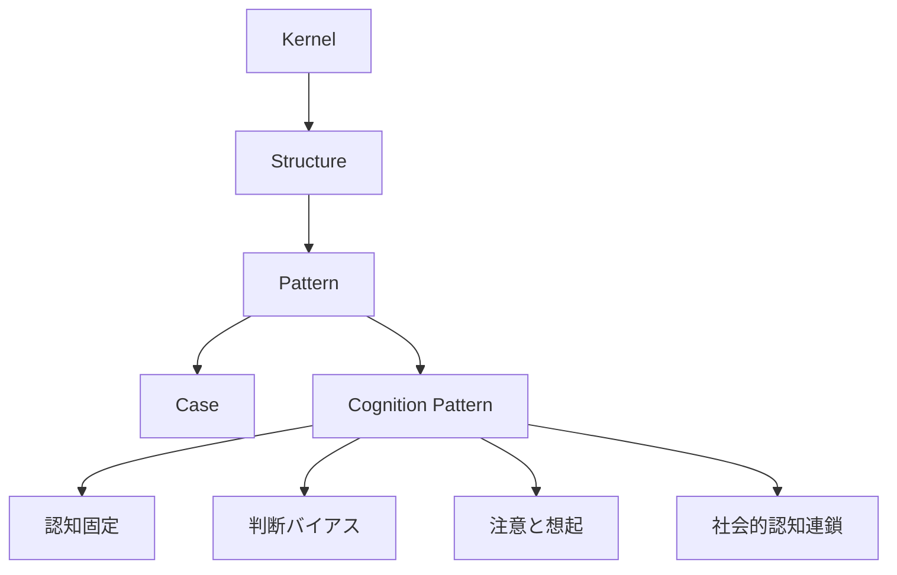
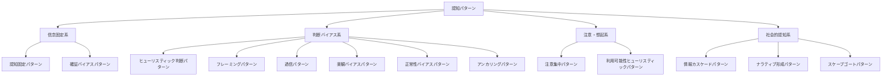
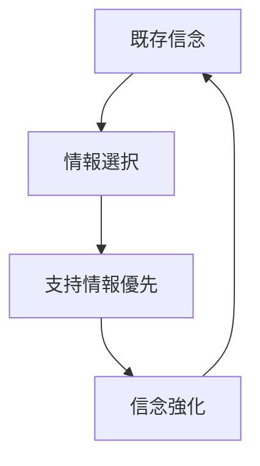
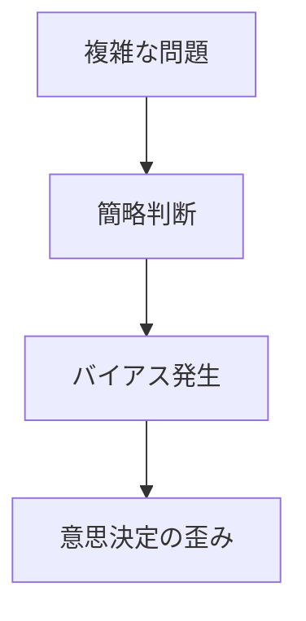
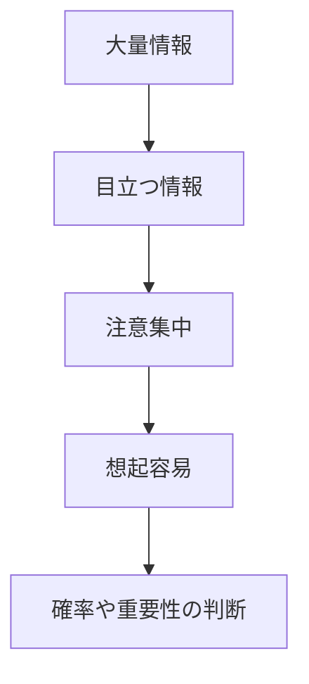
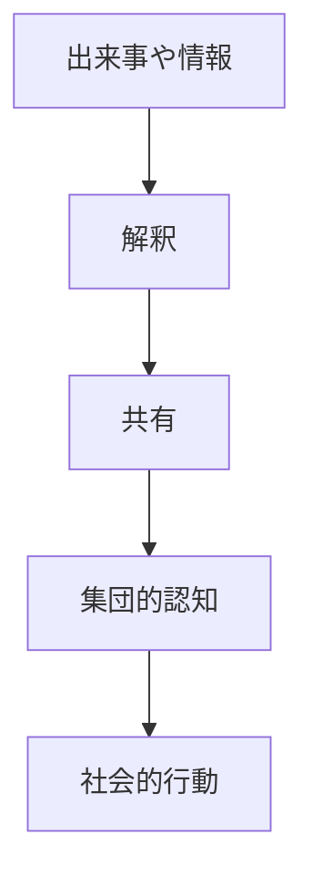
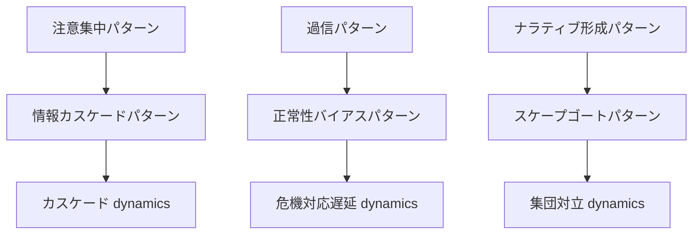

# Cognition Pattern Hub

Cognition Pattern は、人間の認知・判断・解釈がどのように歪み、固定化され、拡散し、社会的影響に接続されるかを整理するための Pattern 群である。

この Hub は、認知バイアス・判断パターン・注意配分・物語化・社会的認知連鎖を束ねる入口ノートである。

---

# 位置づけ

---

# 全体マップ

---

# 1. 信念固定系

信念や世界観がどのように維持され、修正されにくくなるかを扱う。

## ノート一覧

- [[02_zettelkasten/Zettelkasten Engine/02_knowledge/world_model/meta/pattern/cognition/認知固定パターン]]
- [[02_zettelkasten/Zettelkasten Engine/02_knowledge/world_model/meta/pattern/cognition/確証バイアスパターン]]

## 説明

この群は、

- 既存信念の維持
- 反証情報の排除
- 世界観の自己強化

を説明する。

## 基本連鎖

---

# 2. 判断バイアス系

不完全な認知資源のもとで、どのように判断が簡略化され、歪むかを扱う。

## ノート一覧

- [[02_zettelkasten/Zettelkasten Engine/02_knowledge/world_model/meta/pattern/cognition/ヒューリスティック判断パターン]]
- [[02_zettelkasten/Zettelkasten Engine/02_knowledge/world_model/meta/pattern/cognition/フレーミングパターン]]
- [[02_zettelkasten/Zettelkasten Engine/02_knowledge/world_model/meta/pattern/cognition/過信パターン]]
- [[02_zettelkasten/Zettelkasten Engine/02_knowledge/world_model/meta/pattern/cognition/楽観バイアスパターン]]
- [[02_zettelkasten/Zettelkasten Engine/02_knowledge/world_model/meta/pattern/cognition/正常性バイアスパターン]]
- [[02_zettelkasten/Zettelkasten Engine/02_knowledge/world_model/meta/pattern/cognition/アンカリングパターン]]

## 説明

この群は、

- 直感的判断
- リスク認知の歪み
- 初期情報への依存
- 危機判断の失敗

を説明する。

## 基本連鎖

---

# 3. 注意・想起系

何に注意が向き、何が思い出されやすく、それが判断にどう影響するかを扱う。

## ノート一覧

- [[02_zettelkasten/Zettelkasten Engine/02_knowledge/world_model/meta/pattern/cognition/注意集中パターン]]
- [[02_zettelkasten/Zettelkasten Engine/02_knowledge/world_model/meta/pattern/cognition/利用可能性ヒューリスティックパターン]]

## 説明

この群は、

- 目立つ対象への集中
- 思い出しやすさによる判断
- メディア・SNS効果

を説明する。

## 基本連鎖

---

# 4. 社会的認知系

個人の認知が、模倣・物語化・責任転嫁によって社会的現象に変わる過程を扱う。

## ノート一覧

- [[02_zettelkasten/Zettelkasten Engine/02_knowledge/world_model/meta/pattern/cognition/情報カスケードパターン]]
- [[02_zettelkasten/Zettelkasten Engine/02_knowledge/world_model/meta/pattern/cognition/ナラティブ形成パターン]]
- [[02_zettelkasten/Zettelkasten Engine/02_knowledge/world_model/meta/pattern/cognition/スケープゴートパターン]]

## 説明

この群は、

- 他者判断への追随
- 出来事の物語化
- 敵の設定と責任転嫁

を説明する。

## 基本連鎖

---

# 重要な接続

## 信念固定への接続

- [[02_zettelkasten/Zettelkasten Engine/02_knowledge/world_model/meta/pattern/cognition/自己正当化パターン]]
- [[02_zettelkasten/Zettelkasten Engine/02_knowledge/world_model/meta/pattern/cognition/アイデンティティ防衛パターン]]

## 社会心理への接続

- [[02_zettelkasten/Zettelkasten Engine/02_knowledge/world_model/meta/pattern/cognition/社会的同調パターン]]
- [[02_zettelkasten/Zettelkasten Engine/02_knowledge/world_model/meta/pattern/cognition/パニックパターン]]

## 構造ノートへの接続

- [[認知バイアス構造]]
- [[フレーミング構造]]
- [[注意構造]]
- [[社会的影響構造]]
- [[02_zettelkasten/Zettelkasten Engine/02_knowledge/world_model/pattern/social/structure/集団対立構造]]

## Kernel への接続

- [[02_zettelkasten/Zettelkasten Engine/02_knowledge/world_model/meta/model/human/congnition/限定合理性]]
- [[認知節約原理]]
- [[02_zettelkasten/Zettelkasten Engine/02_knowledge/world_model/meta/model/social/constraints/注意資源制約]]
- [[自己保存原理]]
- [[02_zettelkasten/Zettelkasten Engine/02_knowledge/world_model/meta/model/human/社会性原理]]
- [[02_zettelkasten/Zettelkasten Engine/02_knowledge/world_model/meta/model/human/模倣原理]]
- [[02_zettelkasten/Zettelkasten Engine/02_knowledge/world_model/meta/model/human/物語化原理]]

---

# 認知パターンの読み順

## 最小ルート

1. [[02_zettelkasten/Zettelkasten Engine/02_knowledge/world_model/meta/pattern/cognition/ヒューリスティック判断パターン]]
2. [[02_zettelkasten/Zettelkasten Engine/02_knowledge/world_model/meta/pattern/cognition/確証バイアスパターン]]
3. [[02_zettelkasten/Zettelkasten Engine/02_knowledge/world_model/meta/pattern/cognition/フレーミングパターン]]
4. [[02_zettelkasten/Zettelkasten Engine/02_knowledge/world_model/meta/pattern/cognition/注意集中パターン]]
5. [[02_zettelkasten/Zettelkasten Engine/02_knowledge/world_model/meta/pattern/cognition/情報カスケードパターン]]

## 危機判断ルート

1. [[02_zettelkasten/Zettelkasten Engine/02_knowledge/world_model/meta/pattern/cognition/過信パターン]]
2. [[02_zettelkasten/Zettelkasten Engine/02_knowledge/world_model/meta/pattern/cognition/楽観バイアスパターン]]
3. [[02_zettelkasten/Zettelkasten Engine/02_knowledge/world_model/meta/pattern/cognition/正常性バイアスパターン]]
4. [[02_zettelkasten/Zettelkasten Engine/02_knowledge/world_model/meta/pattern/cognition/パニックパターン]]

## 社会認知ルート

1. [[02_zettelkasten/Zettelkasten Engine/02_knowledge/world_model/meta/pattern/cognition/フレーミングパターン]]
2. [[02_zettelkasten/Zettelkasten Engine/02_knowledge/world_model/meta/pattern/cognition/ナラティブ形成パターン]]
3. [[02_zettelkasten/Zettelkasten Engine/02_knowledge/world_model/meta/pattern/cognition/スケープゴートパターン]]
4. [[02_zettelkasten/Zettelkasten Engine/02_knowledge/world_model/meta/pattern/cognition/情報カスケードパターン]]

## 信念固定ルート

1. [[02_zettelkasten/Zettelkasten Engine/02_knowledge/world_model/meta/pattern/cognition/認知固定パターン]]
2. [[02_zettelkasten/Zettelkasten Engine/02_knowledge/world_model/meta/pattern/cognition/確証バイアスパターン]]
3. [[02_zettelkasten/Zettelkasten Engine/02_knowledge/world_model/meta/pattern/cognition/自己正当化パターン]]
4. [[02_zettelkasten/Zettelkasten Engine/02_knowledge/world_model/meta/pattern/cognition/アイデンティティ防衛パターン]]

---

# 一覧

## Core

- [[02_zettelkasten/Zettelkasten Engine/02_knowledge/world_model/meta/pattern/cognition/認知固定パターン]]
- [[02_zettelkasten/Zettelkasten Engine/02_knowledge/world_model/meta/pattern/cognition/確証バイアスパターン]]
- [[02_zettelkasten/Zettelkasten Engine/02_knowledge/world_model/meta/pattern/cognition/ヒューリスティック判断パターン]]
- [[02_zettelkasten/Zettelkasten Engine/02_knowledge/world_model/meta/pattern/cognition/フレーミングパターン]]

## Judgment Bias

- [[02_zettelkasten/Zettelkasten Engine/02_knowledge/world_model/meta/pattern/cognition/過信パターン]]
- [[02_zettelkasten/Zettelkasten Engine/02_knowledge/world_model/meta/pattern/cognition/楽観バイアスパターン]]
- [[02_zettelkasten/Zettelkasten Engine/02_knowledge/world_model/meta/pattern/cognition/正常性バイアスパターン]]
- [[02_zettelkasten/Zettelkasten Engine/02_knowledge/world_model/meta/pattern/cognition/アンカリングパターン]]

## Attention / Memory

- [[02_zettelkasten/Zettelkasten Engine/02_knowledge/world_model/meta/pattern/cognition/注意集中パターン]]
- [[02_zettelkasten/Zettelkasten Engine/02_knowledge/world_model/meta/pattern/cognition/利用可能性ヒューリスティックパターン]]

## Social Cognition

- [[02_zettelkasten/Zettelkasten Engine/02_knowledge/world_model/meta/pattern/cognition/情報カスケードパターン]]
- [[02_zettelkasten/Zettelkasten Engine/02_knowledge/world_model/meta/pattern/cognition/ナラティブ形成パターン]]
- [[02_zettelkasten/Zettelkasten Engine/02_knowledge/world_model/meta/pattern/cognition/スケープゴートパターン]]

---

# dynamics への橋渡し

Cognition Pattern は、個人認知の歪みを扱う。  
Dynamics は、それが時間と相互作用の中でどう連鎖・増幅・崩壊するかを扱う。

## 接続例

---

# メモ

Cognition Pattern は「人がどう誤るか」を扱う。  
Dynamics は「その誤りがどう拡大するか」を扱う。

したがって、

- cognition = 認知様式
- dynamics = 展開様式

として分けると整理しやすい。

---