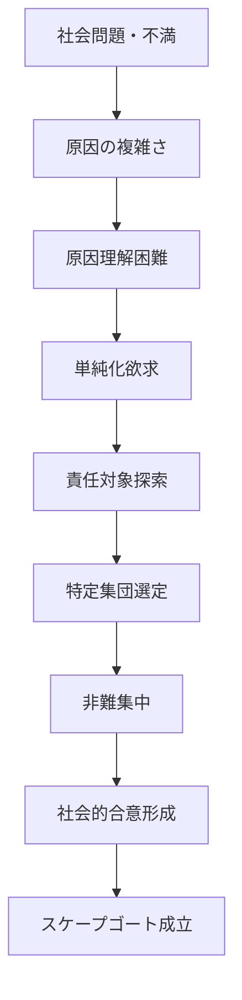

# スケープゴートパターン

社会や集団に問題や不満が生じたとき、  
原因が複雑で理解しにくい場合、人々は特定の個人や集団に責任を集中させる傾向がある。

このように問題の原因を象徴的な対象に押し付ける現象を  
**スケープゴートパターン**と呼ぶ。

---

# パターン構造



---

# 説明

社会問題の原因はしばしば

- 複雑
- 多因子
- 長期的

である。

しかし人間は

- 認知負荷を減らす
- 感情を解消する
- 集団結束を強める

ために

**単純な原因を求める。**

その結果

```
問題
↓
誰かの責任
```

という構図が作られる。

---

# 典型的パターン

## 社会的不満の転嫁

例

- 不況 → 移民の責任
- 治安悪化 → 特定集団

---

## 政治利用

例

- 政権批判回避
- 外敵の強調

---

## 集団心理

例

- 集団内結束
- 共通の敵

---

# 社会での例

歴史

- 魔女狩り
- ユダヤ人迫害

政治

- 外国勢力への責任転嫁

組織

- 失敗の責任者探し

SNS

- 個人への炎上

---

# 特徴

スケープゴートは

- 複雑な問題を単純化する
- 感情の出口になる
- 集団結束を強める

という効果を持つ。

---

# 関連

Structure  
[[02_zettelkasten/Zettelkasten Engine/02_knowledge/world_model/pattern/social/structure/集団対立構造]]

Kernel  

[[02_zettelkasten/Zettelkasten Engine/02_knowledge/world_model/meta/model/human/社会性原理]]  
[[自己保存原理]]  
[[02_zettelkasten/Zettelkasten Engine/02_knowledge/world_model/meta/model/human/物語化原理]]

関連Pattern  

[[02_zettelkasten/Zettelkasten Engine/02_knowledge/world_model/meta/pattern/cognition/ナラティブ形成パターン]]  
[[02_zettelkasten/Zettelkasten Engine/02_knowledge/world_model/meta/pattern/cognition/アイデンティティ防衛パターン]]  
[[02_zettelkasten/Zettelkasten Engine/02_knowledge/world_model/meta/pattern/cognition/社会的同調パターン]]

Case  

[[魔女狩り]]  
[[政治的スケープゴート]]  
[[SNS炎上]]