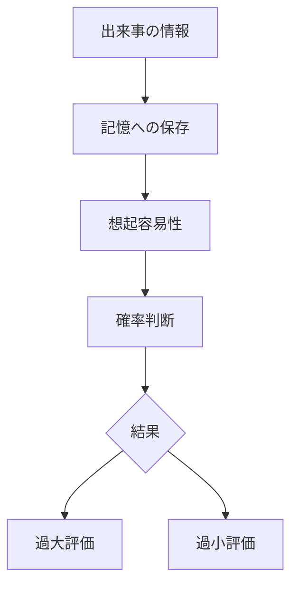

# 利用可能性ヒューリスティックパターン

人間は出来事の発生確率や重要性を判断する際、  
統計的な頻度ではなく、思い出しやすい事例に基づいて判断する傾向を持つ。

このように記憶の利用可能性によって判断が形成される現象を  
**利用可能性ヒューリスティックパターン**と呼ぶ。

---

# パターン構造



---

# 説明

人間は出来事の頻度を直接計算するのではなく、

- 思い出しやすさ
- 印象の強さ
- 最近の経験

などを基準に判断する。

その結果

```
思い出しやすい
↓
頻繁に起きると判断
```

という認知が生まれる。

---

# 典型的パターン

## メディア効果

例

- 犯罪報道の多さ  
→ 犯罪増加と感じる

---

## 最近性

例

- 最近起きた事故  
→ 危険性を過大評価

---

## 印象強度

例

- 災害映像  
→ 発生確率を過大評価

---

# 社会での例

リスク認知

- 飛行機事故恐怖
- 原発事故恐怖

メディア

- 犯罪報道

SNS

- バズ事件

政治

- 治安不安

---

# 特徴

利用可能性ヒューリスティックは

- 印象の強い情報に影響される
- 最近の出来事を重視する
- 統計判断を歪める

という性質を持つ。

---

# 関連

Structure  
[[認知バイアス構造]]

Kernel  

[[02_zettelkasten/Zettelkasten Engine/02_knowledge/world_model/meta/model/human/congnition/限定合理性]]  
[[認知節約原理]]  
[[02_zettelkasten/Zettelkasten Engine/02_knowledge/world_model/meta/model/social/constraints/注意資源制約]]

関連Pattern  

[[02_zettelkasten/Zettelkasten Engine/02_knowledge/world_model/meta/pattern/cognition/ヒューリスティック判断パターン]]  
[[02_zettelkasten/Zettelkasten Engine/02_knowledge/world_model/meta/pattern/cognition/注意集中パターン]]  
[[02_zettelkasten/Zettelkasten Engine/02_knowledge/world_model/meta/pattern/cognition/フレーミングパターン]]

Case  

[[犯罪報道]]  
[[災害報道]]