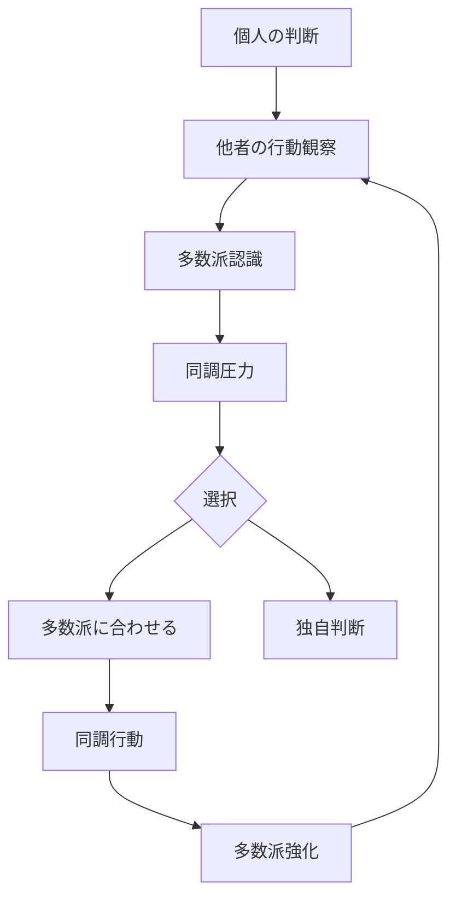

# 社会的同調パターン

人間は、集団の行動や意見に合わせる傾向を持つ。

この傾向により、人々の行動や意見は集団の多数派に収束していく。

この現象を **社会的同調パターン** と呼ぶ。

---

# パターン構造

---

# 説明

人間は社会的動物であるため、

- 集団からの排除
- 社会的評価
- 協調関係

を意識して行動する。

その結果、人は

**自分の判断より集団の判断を優先する**

ことが多い。

---

# 同調の二つのタイプ

## 規範的同調

集団に受け入れられるために同調する。

例

- 空気を読む
- 会議で反対意見を言わない
- 周囲に合わせる

---

## 情報的同調

他者の判断を正しいと考えて同調する。

例

- 皆が買う株を買う
- 人気店に並ぶ
- レビュー評価に従う

---

# 社会での例

## 日常

- 流行
- ファッション
- SNSトレンド

## 経済

- 投資バブル
- 市場パニック

## 政治

- 世論形成
- 集団運動
- プロパガンダ

---

# 特徴

社会的同調は

- 少数意見を消す
- 集団判断を偏らせる
- 行動を急速に拡散させる

という性質を持つ。

---

# 関連

Structure  
[[02_zettelkasten/Zettelkasten Engine/02_knowledge/world_model/model/human/社会的影響]]

Kernel  
[[02_zettelkasten/Zettelkasten Engine/02_knowledge/world_model/meta/model/human/社会性原理]]  
[[02_zettelkasten/Zettelkasten Engine/02_knowledge/world_model/meta/model/human/模倣原理]]

関連Pattern  

[[02_zettelkasten/Zettelkasten Engine/02_knowledge/world_model/meta/pattern/cognition/自己正当化パターン]]  
[[02_zettelkasten/Zettelkasten Engine/02_knowledge/world_model/meta/pattern/cognition/アイデンティティ防衛パターン]]

Case  

[[SNS炎上]]  
[[株式バブル]]