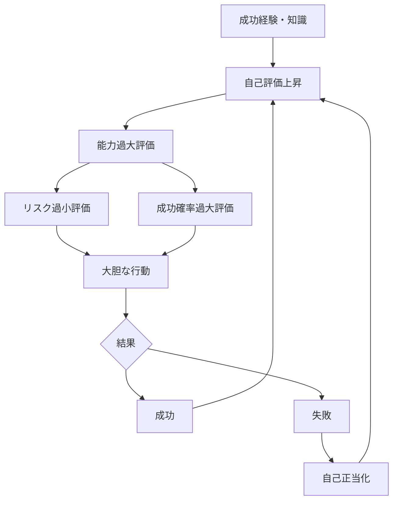

# 過信パターン

人間は、自分の知識・判断・能力を実際よりも高く評価する傾向を持つ。

この傾向により、人はリスクを過小評価し、成功確率を過大評価する。

この現象を **過信パターン** と呼ぶ。

---

# パターン構造

---

# 説明

人間は自分の判断能力を信頼する傾向がある。

しかしその信頼はしばしば過剰になり、

- 不確実性の軽視
- 警告の無視
- リスクの過小評価

を引き起こす。

このため過信は

**失敗の重要な原因**になる。

---

# 典型的パターン

## 能力過信

例

- 自分は平均より優秀と思う
- 自分の判断は正しいと信じる

---

## 知識過信

例

- 少ない情報で結論を出す
- 専門外でも判断する

---

## 制御過信

例

- 市場をコントロールできる
- 状況を管理できると思う

---

# 社会での例

投資

- バブル投資
- 過度なリスク

経営

- 無謀な拡張
- 事業失敗

戦争

- 短期勝利の過信

政治

- 世論読み違い

---

# 特徴

過信は

- 成功経験で強化される
- 集団で増幅する
- 失敗しても修正されにくい

という性質を持つ。

---

# 関連

Structure  
[[認知バイアス構造]]

Kernel  

[[02_zettelkasten/Zettelkasten Engine/02_knowledge/world_model/meta/model/human/congnition/限定合理性]]  
[[認知節約原理]]  
[[自己保存原理]]

関連Pattern  

[[02_zettelkasten/Zettelkasten Engine/02_knowledge/world_model/meta/pattern/cognition/自己正当化パターン]]  
[[02_zettelkasten/Zettelkasten Engine/02_knowledge/world_model/meta/pattern/cognition/フレーミングパターン]]

Case  

[[投資バブル]]  
[[戦争過信]]