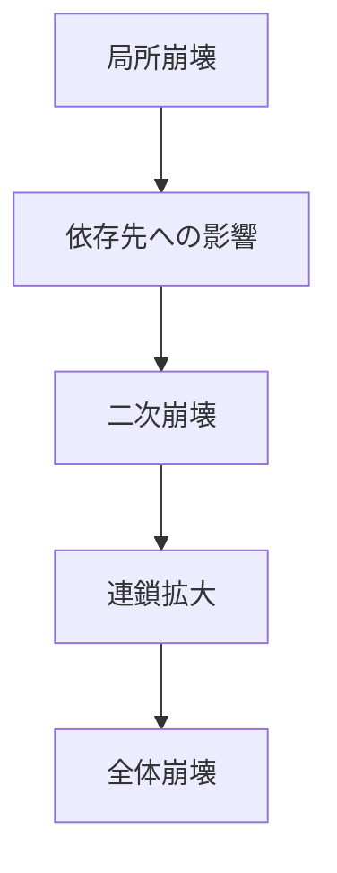

# 連鎖崩壊パターン

ある要素の崩壊が隣接要素や依存先へ波及し、個別の故障がシステム全体の崩壊へ連鎖するダイナミクスを **連鎖崩壊パターン** と呼ぶ。

---

# パターン構造

---

# 説明

システム要素が相互依存しているとき、単独の故障は孤立せず、他の要素の故障確率を上げる。

そのため連鎖崩壊は

- ネットワーク依存
- 冗長性不足
- 中核ノードの脆弱性

に強く依存する。

---

# 典型的局面

## 局所障害

一箇所で故障が起きる。

## 波及

依存関係に沿って負荷が移る。

## 二次崩壊

他所でも故障する。

## 全体化

障害がシステム全体へ広がる。

---

# 社会での例

- 金融危機の波及
- 停電連鎖
- サプライチェーン崩壊
- 組織内の離職連鎖

---

# 特徴

連鎖崩壊は

- 相互依存が強いほど起きやすい
- カスケードの崩壊版といえる
- 予防には分散化と冗長性が重要

---

# 関連

Structure  
[[連鎖構造]]

Pattern  
[[02_zettelkasten/Zettelkasten Engine/02_knowledge/world_model/pattern/dynamics/mechanism/カスケードパターン]]  
[[02_zettelkasten/Zettelkasten Engine/02_knowledge/world_model/pattern/dynamics/mechanism/崩壊パターン]]  
[[02_zettelkasten/Zettelkasten Engine/02_knowledge/world_model/meta/pattern/dynamics/behavior/臨界崩壊パターン]]

Case  
[[停電連鎖]]  
[[金融危機波及]]