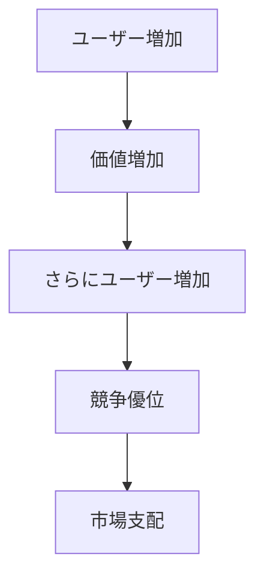

# 勝者総取りパターン

ネットワーク効果や規模の経済によって、1つの企業が市場の大部分を占有するパターン。

---

# パターン構造

---

# 説明

ユーザーが増えるほど価値が上がる市場では、最も大きい企業がさらに有利になる。

その結果

- 競争が急速に収束
- 巨大企業が出現

する。

---

# 例

- Google
- Facebook
- Windows

---

# 関連

Structure  
[[02_zettelkasten/Zettelkasten Engine/02_knowledge/world_model/pattern/market/structure/ネットワーク市場構造]]

Pattern  
[[02_zettelkasten/Zettelkasten Engine/02_knowledge/world_model/meta/pattern/market/pattern/市場ロックインパターン]]