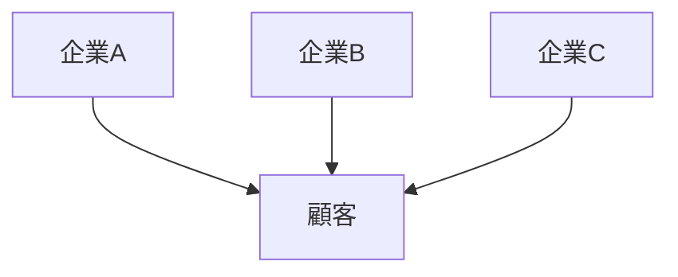

# 競争構造

競争構造とは、市場において複数の主体が同一または類似の価値を提供し、顧客・資源・利益をめぐって競合する関係の構造である。

競争は市場の基本メカニズムであり、価格・品質・技術・ブランドなどの要素によって展開される。

---

# 基本構造

---

# 主要要素

## 競争主体

市場に参加する企業・組織・個人。

## 競争対象

顧客・市場シェア・利益。

## 競争手段

- 価格
- 品質
- 技術
- ブランド
- サービス

---

# 競争のタイプ

## 価格競争

価格の低下による競争。

## 品質競争

性能や品質の改善。

## 技術競争

革新による優位確立。

## ブランド競争

イメージと信頼による競争。

---

# 関連

Pattern  
[[02_zettelkasten/Zettelkasten Engine/02_knowledge/world_model/pattern/market/pattern/価格戦争パターン]]  
[[02_zettelkasten/Zettelkasten Engine/02_knowledge/world_model/pattern/market/pattern/差別化パターン]]

Structure  
[[02_zettelkasten/Zettelkasten Engine/02_knowledge/world_model/meta/pattern/market/structure/参入障壁構造]]  
[[02_zettelkasten/Zettelkasten Engine/02_knowledge/world_model/meta/pattern/market/structure/寡占構造]]