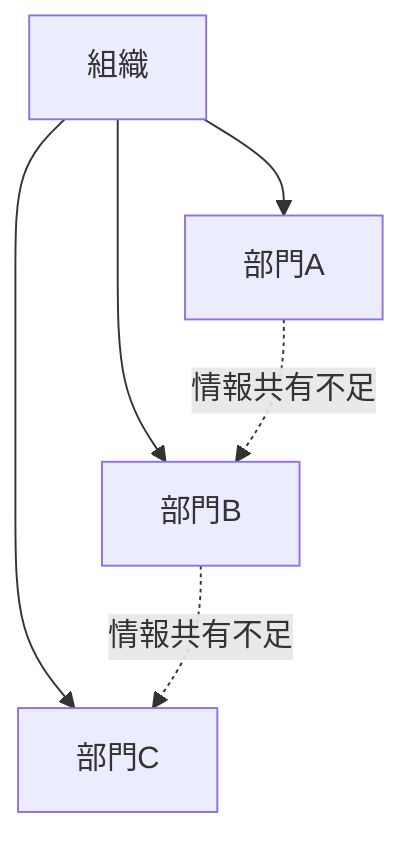

# サイロ化パターン

組織内の部門が独立した単位として閉じ、情報共有や協力が弱くなる現象。

部門が「縦割り」になり、組織全体よりも部門利益が優先される。

---

# パターン構造

---

# 発生要因

- 強い分業
- 部門評価制度
- 組織規模拡大
- 部門間競争

---

# 結果

- 情報断絶
- 組織非効率
- 重複業務
- 意思決定遅延

---

# 例

- 大企業の縦割り組織
- 官僚機構の省庁分断

---

# 関連

Structure  
[[02_zettelkasten/Zettelkasten Engine/02_knowledge/world_model/pattern/organization/structure/情報構造]]  
[[02_zettelkasten/Zettelkasten Engine/02_knowledge/world_model/pattern/organization/structure/役割構造]]

Pattern  
[[02_zettelkasten/Zettelkasten Engine/02_knowledge/world_model/meta/pattern/organization/pattern/information/情報歪曲パターン]]  
[[02_zettelkasten/Zettelkasten Engine/02_knowledge/world_model/pattern/organization/pattern/behavior/意思決定遅延パターン]]