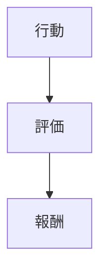

# インセンティブ構造

インセンティブ構造とは、組織メンバーの行動を動機づける報酬・評価・罰則の仕組みである。

---

# 基本構造

---

# インセンティブの種類

- 金銭報酬
- 地位
- 評価
- 承認

---

# 問題

- モラルハザード
- 代理問題

---

# 関連

[[02_zettelkasten/Zettelkasten Engine/02_knowledge/world_model/meta/pattern/organization/structure/意思決定構造]]  
[[02_zettelkasten/Zettelkasten Engine/02_knowledge/world_model/meta/pattern/organization/structure/権力構造]]