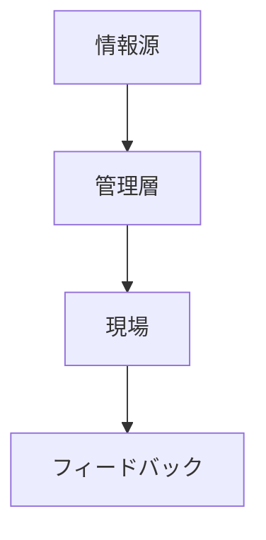

# 情報構造

情報構造とは、組織における情報の流れと共有の構造である。

---

# 基本構造

---

# 問題

- 情報遅延
- 情報歪曲
- 情報独占

---

# 関連

[[02_zettelkasten/Zettelkasten Engine/02_knowledge/world_model/meta/pattern/organization/structure/権力構造]]  
[[02_zettelkasten/Zettelkasten Engine/02_knowledge/world_model/meta/pattern/organization/structure/意思決定構造]]