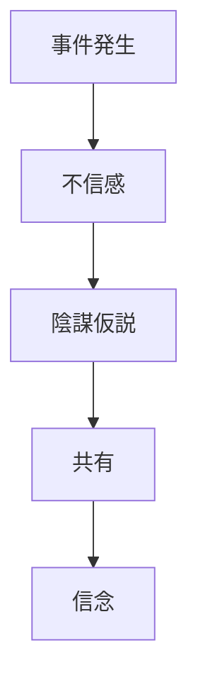

# 陰謀論

社会的事件や権力構造を、秘密の計画や陰謀として説明する信念体系。

---

# 基本構造

# 特徴
- 反証耐性
- 内集団強化
- 外部不信
# 関連
[[02_zettelkasten/Zettelkasten Engine/02_knowledge/world_model/pattern/cognition/確証バイアスパターン]]
[[02_zettelkasten/Zettelkasten Engine/02_knowledge/world_model/pattern/cognition/情報カスケードパターン]]