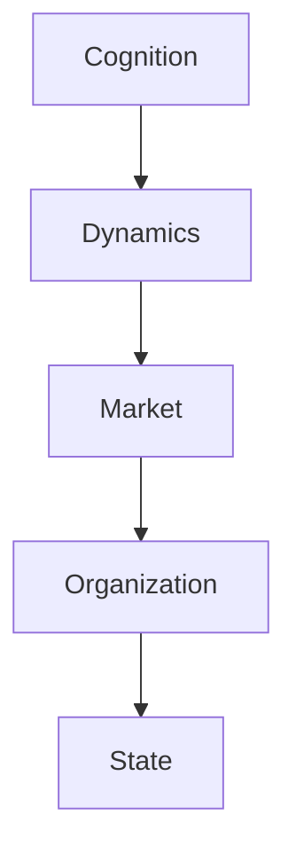
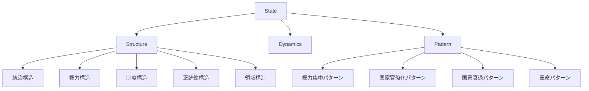

# State Hub

State（国家）は、一定の領域・人口・権力装置を持ち、社会秩序を維持する政治組織である。

国家は

- 権力
- 制度
- 統治
- 正統性

などの要素によって構成される。

---

# 位置づけ

---

# 全体構造

---

# 関連

Structure

[[02_zettelkasten/Zettelkasten Engine/02_knowledge/world_model/pattern/organization/structure/官僚制構造]]  
[[02_zettelkasten/Zettelkasten Engine/02_knowledge/world_model/meta/pattern/organization/structure/権力構造]]

Pattern

[[02_zettelkasten/Zettelkasten Engine/02_knowledge/world_model/meta/pattern/organization/pattern/power/権力集中パターン]]