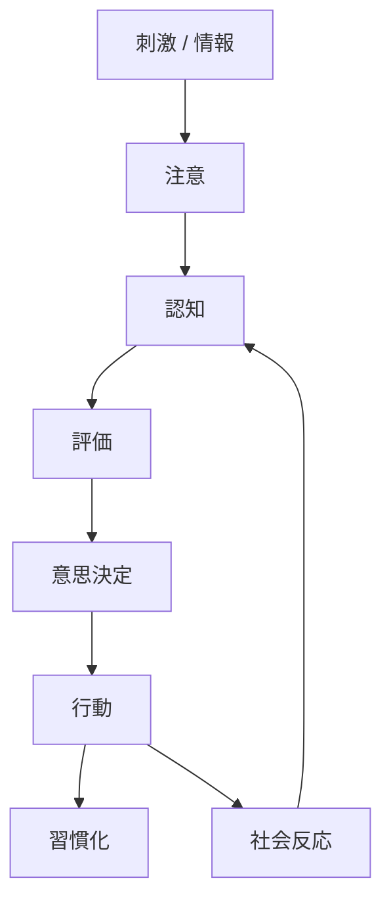

# Psychological Mechanisms Hub

心理的メカニズムとは、人間の知覚 → 判断 → 行動 → 社会反応を生み出す内部プロセスである。

---

# 全体構造

---

# 1 注意メカニズム

情報の選択。

- H-S-015 [[注意資源構造]]    
- H-S-016 [[サリエンス構造]]    
- H-S-017 [[新奇性検出]]
    

---

# 2 知覚メカニズム

世界の感覚的認識。

- H-S-018 [[知覚構造]]    
- H-S-019 [[02_zettelkasten/Zettelkasten Engine/02_knowledge/world_model/model/human/congnition/パターン認識原理]]    
- H-S-020 [[ゲシュタルト知覚]]    

---

# 3 認知メカニズム

情報解釈。

- H-S-001 [[02_zettelkasten/Zettelkasten Engine/02_knowledge/world_model/model/human/congnition/認知バイアス]]    
- H-S-002 [[02_zettelkasten/Zettelkasten Engine/02_knowledge/world_model/model/human/congnition/フレーミング効果]]    
- H-S-003 [[02_zettelkasten/Zettelkasten Engine/02_knowledge/world_model/model/human/congnition/ヒューリスティック構造]]    
- H-S-021 [[メンタルモデル]]    

---

# 4 評価メカニズム（感情）

価値判断。

- H-S-007 [[感情生成構造]]    
- H-S-008 [[感情調整構造]]    
- H-S-022 [[報酬評価構造]]    
- H-S-023 [[02_zettelkasten/Zettelkasten Engine/02_knowledge/world_model/model/human/motivation/損失回避]]    

---

# 5 意思決定メカニズム

選択形成。

- H-S-004 [[期待価値モデル]]    
- H-S-005 [[02_zettelkasten/Zettelkasten Engine/02_knowledge/world_model/model/human/プロスペクト理論]]    
- H-S-006 [[満足化モデル]]    
- H-S-024 [[時間割引構造]]    
- H-S-025 [[探索と活用]]

---

# 6 行動メカニズム

実行。

- H-S-026 [[行動選択構造]]    
- H-S-027 [[行動実行構造]]
- H-S-038[[02_zettelkasten/Zettelkasten Engine/02_knowledge/world_model/model/human/learning/行動強化]]

---

# 7 学習メカニズム

経験からの更新。

- H-S-010 [[02_zettelkasten/Zettelkasten Engine/02_knowledge/world_model/model/human/learning/行動強化]]    
- H-S-019 [[オペラント条件づけ]]    
- H-S-028 [[古典的条件づけ]]    
- H-S-029 [[観察学習]]    

---

# 8 習慣メカニズム

自動化。

- H-S-009 [[02_zettelkasten/Zettelkasten Engine/02_knowledge/world_model/model/human/learning/習慣ループ]]    
- H-S-030 [[行動自動化]]
    

---

# 9 動機メカニズム

行動のエネルギー。

- H-S-031 [[欲求構造]]    
- H-S-032 [[内発的動機]]    
- H-S-033 [[外発的動機]]    
- H-S-034 [[自己効力感]]    

---

# 10 自己概念

長期的行動。

- H-S-022 [[アイデンティティ構造]]    
- H-S-035 [[認知的不協和]]    

---

# 11 社会心理メカニズム

社会的影響。

- H-S-011 [[02_zettelkasten/Zettelkasten Engine/02_knowledge/world_model/model/human/社会的証明]]    
- H-S-012 [[02_zettelkasten/Zettelkasten Engine/02_knowledge/world_model/model/human/congnition/権威影響]]    
- H-S-013 [[02_zettelkasten/Zettelkasten Engine/02_knowledge/world_model/model/human/同調]]    
- H-S-014 [[ステータス構造]]    
- H-S-036 [[互恵性]]    
- H-S-037 [[内集団バイアス]]

---

# 重要ポイント

心理メカニズムは次の連鎖で理解できる。

1. 刺激  
2. 注意  
3. 認知  
4. 感情評価  
5. 意思決定  
6. 行動  
7. 習慣  
8. 社会反応  
9. 自己概念更新