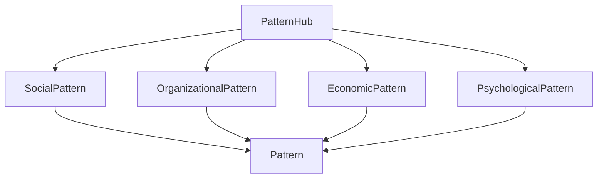
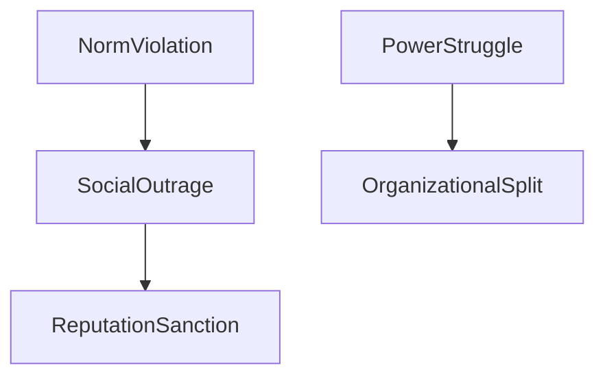
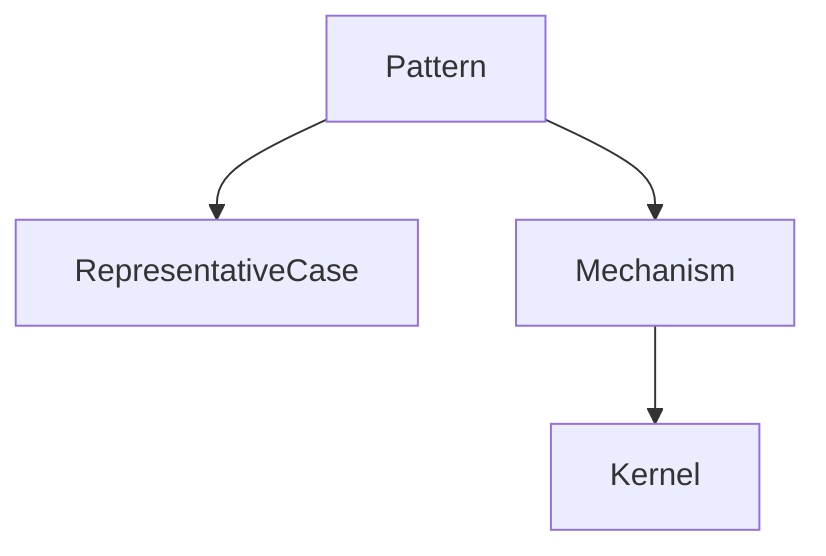

# Pattern Hub

Pattern Hub は、Knowledge Graph において  
**Pattern ノード群を体系的に整理するためのハブノート**である。

Pattern は Knowledge Graph の **中核層**に位置する。

```
case
 ↓
pattern
 ↓
mechanism
 ↓
kernel
```

Case は具体事例、Mechanism は因果説明であり、  
Pattern はその **中間の構造層**である。

Pattern Hub は

- Pattern の一覧
- Pattern 間の関係
- Pattern の分類

を管理する。

---

# Pattern Hub の役割

Pattern Hub は次の役割を持つ。

### 1 Pattern Index

Pattern ノードの一覧。

---

### 2 Pattern Map

Pattern 間の関係を示す。

---

### 3 Pattern Navigation

どの pattern から探索すべきかを示す。

---

### 4 Pattern Boundary 管理

pattern 同士の境界を管理する。

---

# Pattern の階層

Pattern は抽象度に応じて階層を持つ。

```
macro pattern
meso pattern
micro pattern
```

---

## Macro Pattern

社会全体の大きな構造。

例

- 権力争い
- 社会排除
- 評判制裁

---

## Meso Pattern

組織やコミュニティ。

例

- 組織内対立
- 集団同調

---

## Micro Pattern

個人レベル。

例

- 習慣形成
- 意思決定

---

# Pattern 分類

Pattern は次の分野で分類できる。

---

## Social Pattern

社会行動パターン

- [[社会排除パターン]]
- [[炎上パターン]]
- [[評判制裁パターン]]

---

## Organizational Pattern

組織パターン

- [[権力争いパターン]]
- [[02_zettelkasten/Zettelkasten Engine/02_knowledge/world_model/pattern/organization/pattern/behavior/官僚化パターン]]
- [[02_zettelkasten/Zettelkasten Engine/02_knowledge/world_model/pattern/organization/pattern/behavior/責任回避パターン]]

---

## Economic Pattern

経済パターン

- [[02_zettelkasten/Zettelkasten Engine/02_knowledge/world_model/pattern/market/市場競争パターン]]
- [[02_zettelkasten/Zettelkasten Engine/02_knowledge/world_model/pattern/dynamics/behavior/バブルパターン]]

---

## Psychological Pattern

心理パターン

- [[認知バイアスパターン]]
- [[02_zettelkasten/Zettelkasten Engine/02_knowledge/world_model/pattern/cognition/習慣形成パターン]]

---

# Pattern Hub 図



---

# Pattern 間の関係

Pattern は互いに影響する。

例

```
権力争い
 ↓
組織分裂
```

```
規範逸脱
 ↓
炎上
```

---

# Pattern の関係図



---

# Pattern と Mechanism

Pattern は Mechanism の表れである。

```
pattern
 ↓
mechanism
```

例

```
炎上
 ↓
同調メカニズム
```

---

# Pattern と Case

Pattern は複数の case に現れる。

```
case
case
case
 ↓
pattern
```

---

# Pattern と Bridge Concept

Pattern は Bridge Concept で  
異なる domain に接続できる。

例

```
権力争い
```

```
政治
企業
コミュニティ
```

---

# Pattern 探索

Pattern は次の方法で見つかる。

- case comparison
- pattern comparison
- cross domain mapping

---

# Pattern Hub Traversal

Pattern Hub は次の探索の起点になる。

```
pattern
 ↓
representative case
 ↓
mechanism
```

---

# Pattern Hub 図



---

# Pattern Hub の管理ルール

Pattern Hub では次を守る。

---

### Rule1  
Pattern は **複数 case から作る**

---

### Rule2  
Pattern は **進行構造を持つ**

---

### Rule3  
Mechanism と混同しない

---

### Rule4  
Outcome を pattern にしない

---

# Pattern Hub の利用

Pattern Hub は

- reasoning
- prediction
- case analysis

の中心になる。

---

# 関連ノート

- [[Pattern]]
- [[Pattern Extraction Method 1]]
- [[Pattern Comparison 1]]
- [[02_zettelkasten/04_knowledge_graph/Representative Case Rule]]
- [[Knowledge Graph Structure]]