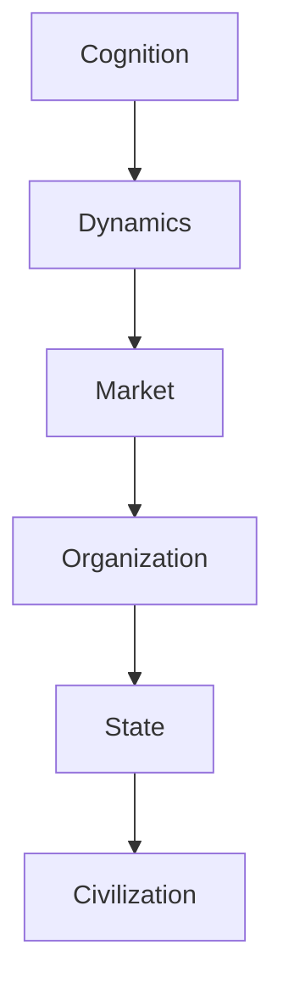
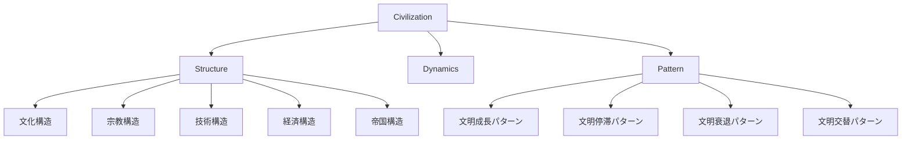

# Civilization Hub

Civilization（文明）は、人類社会が長期にわたり形成する文化・制度・技術・価値体系の複合体である。

文明は国家より長い時間スケールで存在し、宗教・文化・技術・経済・制度を統合する。

---

# 位置づけ

---

# 全体構造

---

# 関連

Structure

[[02_zettelkasten/Zettelkasten Engine/02_knowledge/world_model/pattern/state/structure/制度構造]]  
[[国家権力構造]]

Pattern

[[02_zettelkasten/Zettelkasten Engine/02_knowledge/world_model/pattern/state/pattern/国家衰退パターン]]