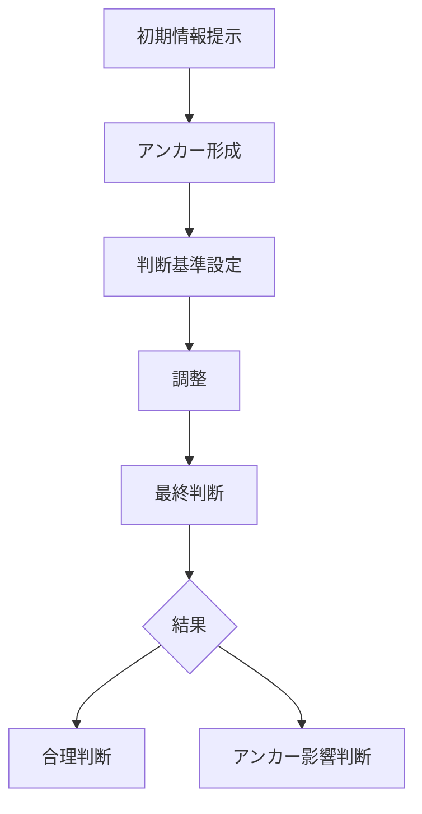

# アンカリングパターン

人間は数値や判断を行う際、  
最初に提示された情報（アンカー）に強く影響される。

その結果、後続の判断はアンカーを基準として調整されるが、  
その調整は不十分であり、判断はアンカーに引きずられる。

この現象を **アンカリングパターン** と呼ぶ。

---

# パターン構造



---

# 説明

人間は数値判断を行う際、

- 完全な計算
- 統計推定
- データ分析

を行う代わりに

**最初に見た数値を基準にする。**

そのため

```
最初の数値
↓
判断基準
↓
調整
```

という過程で判断が行われる。

しかし調整は不十分なため、

**判断はアンカーに引き寄せられる。**

---

# 典型的パターン

## 価格判断

例

- 定価 → 割引価格

---

## 交渉

例

- 最初の提示価格

---

## 数値推定

例

- 人口推定
- 距離推定

---

# 社会での例

マーケティング

- 高い定価表示

交渉

- 初期提示額

投資

- 過去価格への固執

政治

- 初期世論調査

---

# 特徴

アンカリングは

- 初期情報の影響が大きい
- 調整が不十分
- 判断が偏る

という性質を持つ。

---

# 関連

Structure  
[[認知バイアス構造]]

Kernel  

[[02_zettelkasten/Zettelkasten Engine/02_knowledge/world_model/academic/principles/限定合理性]]  
[[認知節約原理]]

関連Pattern  

[[02_zettelkasten/Zettelkasten Engine/02_knowledge/world_model/pattern/cognition/ヒューリスティック判断パターン]]  
[[02_zettelkasten/Zettelkasten Engine/02_knowledge/world_model/pattern/cognition/利用可能性ヒューリスティックパターン]]

Case  

[[価格交渉]]  
[[割引価格表示]]