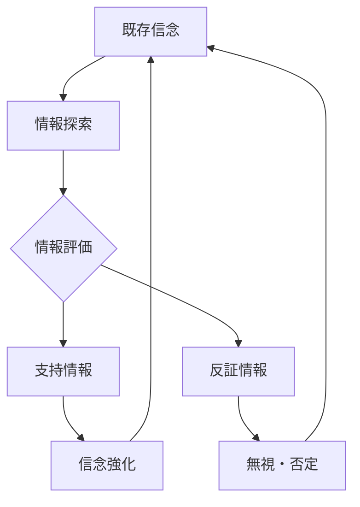

# 確証バイアスパターン

人間は、自分の信念や仮説を支持する情報を優先的に集め、  
それと矛盾する情報を無視・軽視する傾向を持つ。

この傾向を **確証バイアスパターン** と呼ぶ。

---

# パターン構造

---

# 説明

人間は情報を完全に客観的に評価するのではなく、

- 信念
- 世界観
- アイデンティティ

に基づいて情報を選択する。

そのため

**信念に合う情報だけが蓄積される**

という現象が起きる。

---

# 典型的パターン

## 情報選択

例

- 自分の意見に近い記事だけ読む
- SNSで同じ思想の人をフォローする

---

## 反証拒否

例

- 都合の悪いデータを信用しない
- 研究結果を否定する

---

## 解釈歪曲

例

- 同じ事実を自分の立場で解釈する

---

# 社会での例

政治

- 政治的分極化
- 支持政党の情報だけ信じる

投資

- 保有株の好材料だけ探す

宗教

- 教義に合う証拠だけ採用

SNS

- エコーチェンバー形成

---

# 特徴

確証バイアスは

- 強い信念ほど発生しやすい
- 集団内で増幅する
- 情報分断を生む

という特徴を持つ。

---

# 関連

Structure  
[[認知バイアス構造]]

Kernel  

[[02_zettelkasten/Zettelkasten Engine/02_knowledge/world_model/academic/principles/限定合理性]]  
[[認知節約原理]]  
[[自己保存原理]]

関連Pattern  

[[02_zettelkasten/Zettelkasten Engine/02_knowledge/world_model/pattern/cognition/自己正当化パターン]]  
[[02_zettelkasten/Zettelkasten Engine/02_knowledge/world_model/pattern/cognition/アイデンティティ防衛パターン]]  
[[02_zettelkasten/Zettelkasten Engine/02_knowledge/world_model/pattern/cognition/フレーミングパターン]]

Case  

[[02_zettelkasten/Zettelkasten Engine/02_knowledge/world_model/pattern/social/case/陰謀論]]  
[[政治的分極化]]  
[[投資判断失敗]]