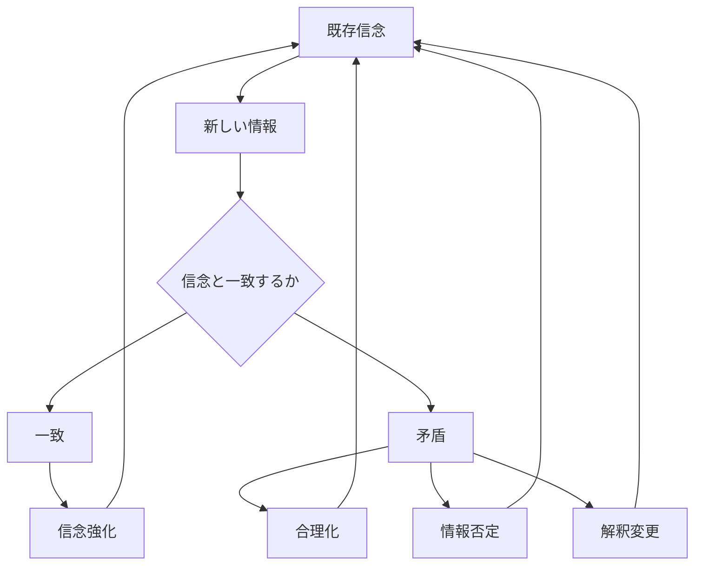

# 認知固定パターン

人間は、一度形成した信念や世界観を維持しようとする傾向を持つ。

このため新しい情報が与えられても信念は容易には修正されず、
むしろ既存の信念を補強する形で認知が再構成される。

この現象を **認知固定パターン** と呼ぶ。

---

# パターン構造

---

# 説明

人間は以下の理由で信念を維持する。

- 認知負荷を減らす
- 自尊心を守る
- アイデンティティを守る
- 社会的関係を維持する

そのため、信念を変更するよりも

**情報を再解釈する**

傾向が強い。

---

# 典型的メカニズム

## 確証バイアス

支持情報のみ収集する。

## 自己正当化

自分の判断を合理化する。

## 情報否定

矛盾する証拠を拒否する。

## アイデンティティ防衛

信念を自己防衛として守る。

---

# 社会での例

政治

- 政治思想の固定化

宗教

- 教義の絶対視

投資

- 損失株の保有継続

陰謀論

- 反証が増えるほど信念強化

---

# 特徴

認知固定は

- 強い信念ほど起きやすい
- 集団内で強化される
- 情報分断を生む

という性質を持つ。

---

# 関連

Structure  
[[認知バイアス構造]]

Kernel  

[[02_zettelkasten/Zettelkasten Engine/02_knowledge/world_model/academic/principles/限定合理性]]  
[[認知節約原理]]  
[[自己保存原理]]

関連Pattern  

[[02_zettelkasten/Zettelkasten Engine/02_knowledge/world_model/pattern/cognition/確証バイアスパターン]]  
[[02_zettelkasten/Zettelkasten Engine/02_knowledge/world_model/pattern/cognition/自己正当化パターン]]  
[[02_zettelkasten/Zettelkasten Engine/02_knowledge/world_model/pattern/cognition/アイデンティティ防衛パターン]]

Case  

[[政治的分極化]]  
[[02_zettelkasten/Zettelkasten Engine/02_knowledge/world_model/pattern/social/case/陰謀論]]