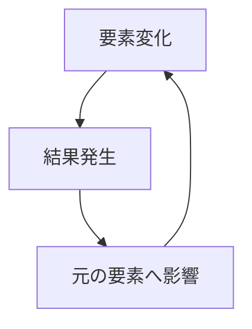

# フィードバックパターン

ある要素の変化が原因となり、その結果が再び元の要素に影響を与える循環をフィードバックと呼ぶ。

この循環により、システムは安定・増幅・振動などの挙動を示す。

---

# パターン構造

---

# 種類

## 正のフィードバック

変化を増幅する

例

- バブル
- 人気拡散
- 炎上

## 負のフィードバック

変化を抑制する

例

- 価格調整
- 体温調整
- 市場均衡

---

# 関連

Structure  
[[因果ループ構造]]

Pattern  
[[02_zettelkasten/Zettelkasten Engine/02_knowledge/world_model/pattern/dynamics/mechanism/増幅パターン]]  
[[02_zettelkasten/Zettelkasten Engine/02_knowledge/world_model/pattern/dynamics/mechanism/ロックインパターン]]