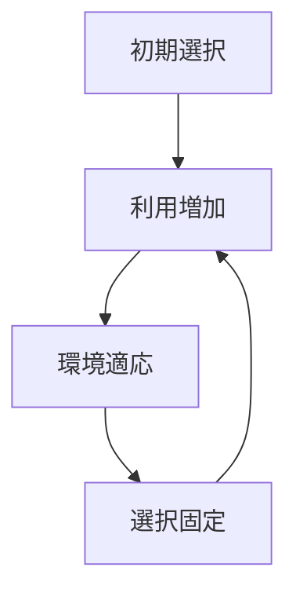

# ロックインパターン

初期条件や偶然の選択が繰り返し強化され、  
他の選択肢が排除されて固定される現象。

---

# パターン構造

---

# 例

- QWERTY配列
- OS市場
- 規格競争

---

# 関連

[[02_zettelkasten/Zettelkasten Engine/02_knowledge/world_model/pattern/dynamics/mechanism/フィードバックパターン]]  
[[02_zettelkasten/Zettelkasten Engine/02_knowledge/world_model/pattern/dynamics/mechanism/増幅パターン]]