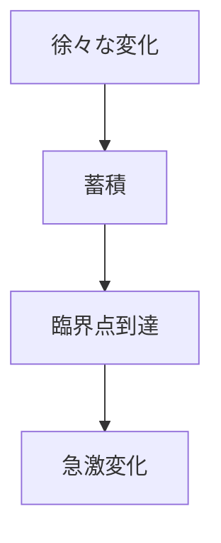

# 臨界点パターン

システムは徐々に変化しているように見えても、  
ある閾値を超えると急激な変化が発生する。

この閾値を臨界点と呼ぶ。

---

# パターン構造

---

# 例

- 社会革命
- 市場暴落
- 生態系崩壊

---

# 関連

[[02_zettelkasten/Zettelkasten Engine/02_knowledge/world_model/pattern/dynamics/mechanism/カスケードパターン]]  
[[02_zettelkasten/Zettelkasten Engine/02_knowledge/world_model/pattern/dynamics/mechanism/崩壊パターン]]