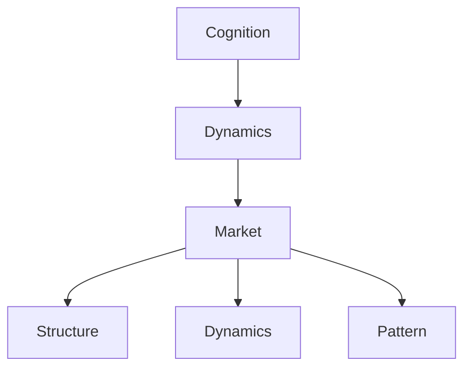
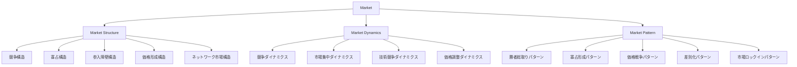
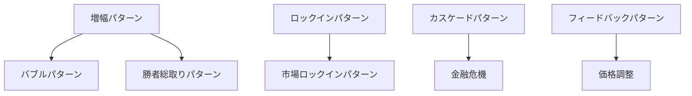
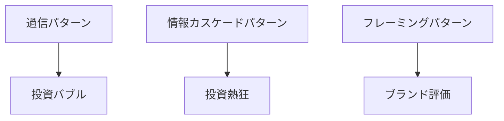

---
note_type: hub
layer: domain
domain: market
status: draft
---

# Market Hub

Market は、財・サービス・情報・資源の交換が行われる社会的システムである。

市場では

- 参加者
- 競争
- 価格
- 情報
- 制度

が相互作用し、資源配分と価値評価が形成される。

この Hub は市場構造、市場ダイナミクス、市場パターンを整理する入口である。

---

# 位置づけ

---

# 全体構造

---

# 1 Market Structure

市場の基本的な構造を扱う。

## ノート一覧

- [[02_zettelkasten/未整理/model 1/world_model/03_social/competition/競争構造]]
- [[02_zettelkasten/未整理/model 1/world_model/03_social/competition/寡占構造]]
- [[02_zettelkasten/未整理/model 1/world_model/03_social/competition/参入障壁構造]]
- [[02_zettelkasten/Zettelkasten Engine/02_knowledge/world_model/pattern/market/structure/価格形成構造]]
- [[02_zettelkasten/Zettelkasten Engine/02_knowledge/world_model/pattern/market/structure/ネットワーク市場構造]]

---

## 説明

市場構造は

- 参加者数
- 参入可能性
- 製品差別化
- 情報
- 技術

によって決まる。

---

# 2 Market Dynamics

市場で起きる時間変化を扱う。

## ノート一覧

- [[競争ダイナミクス]]
- [[市場集中ダイナミクス]]
- [[技術競争ダイナミクス]]
- [[価格調整ダイナミクス]]

---

## 説明

市場は静的ではなく

- 企業参入
- 技術革新
- 価格競争
- 集中化

によって常に変化する。

---

# 3 Market Pattern

市場でよく現れる典型的なパターン。

## ノート一覧

- [[02_zettelkasten/Zettelkasten Engine/02_knowledge/world_model/pattern/market/pattern/勝者総取りパターン]]
- [[02_zettelkasten/Zettelkasten Engine/02_knowledge/world_model/pattern/market/pattern/寡占形成パターン]]
- [[02_zettelkasten/Zettelkasten Engine/02_knowledge/world_model/pattern/market/pattern/価格戦争パターン]]
- [[02_zettelkasten/Zettelkasten Engine/02_knowledge/world_model/pattern/market/pattern/差別化パターン]]
- [[02_zettelkasten/Zettelkasten Engine/02_knowledge/world_model/pattern/market/pattern/市場ロックインパターン]]

---

# Dynamics との接続

---

# Cognition との接続

---

# 読み順

## 最小ルート

1 [[02_zettelkasten/未整理/model 1/world_model/03_social/competition/競争構造]]  
2 [[02_zettelkasten/未整理/model 1/world_model/03_social/competition/参入障壁構造]]  
3 [[02_zettelkasten/未整理/model 1/world_model/03_social/competition/寡占構造]]  
4 [[02_zettelkasten/Zettelkasten Engine/02_knowledge/world_model/pattern/market/structure/価格形成構造]]

---

## ビジネスルート

1 [[02_zettelkasten/未整理/model 1/world_model/03_social/competition/競争構造]]  
2 [[02_zettelkasten/Zettelkasten Engine/02_knowledge/world_model/pattern/market/pattern/差別化パターン]]  
3 [[02_zettelkasten/未整理/model 1/world_model/03_social/competition/参入障壁構造]]  
4 [[02_zettelkasten/Zettelkasten Engine/02_knowledge/world_model/pattern/market/pattern/寡占形成パターン]]

---

## テック市場ルート

1 [[02_zettelkasten/Zettelkasten Engine/02_knowledge/world_model/pattern/market/structure/ネットワーク市場構造]]  
2 [[02_zettelkasten/Zettelkasten Engine/02_knowledge/world_model/pattern/market/pattern/市場ロックインパターン]]  
3 [[02_zettelkasten/Zettelkasten Engine/02_knowledge/world_model/pattern/market/pattern/勝者総取りパターン]]

---

# メモ

Market は

- 経済
- ビジネス
- 技術競争
- プラットフォーム

を理解するための中心領域である。

Dynamics と組み合わせることで

- バブル
- 競争
- 寡占
- 崩壊

などの現象を説明できる。