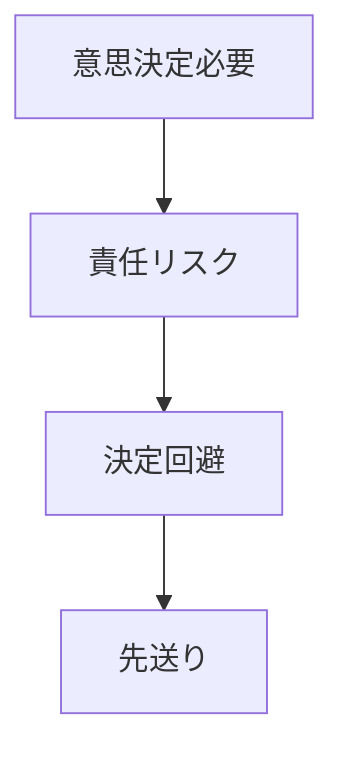

# 責任回避パターン

組織メンバーが責任を負うことを避ける行動パターン。

特に失敗リスクがある意思決定では、責任を回避する行動が増える。

---

# パターン構造

---

# 発生要因

- 失敗の罰則
- 評価制度
- 不明確な責任

---

# 結果

- 意思決定停滞
- 組織停滞

---

# 例

- 官僚の事なかれ主義
- 企業の責任分散

---

# 関連

Structure  
[[02_zettelkasten/Zettelkasten Engine/02_knowledge/world_model/pattern/organization/structure/代理問題構造]]

Pattern  
[[02_zettelkasten/Zettelkasten Engine/02_knowledge/world_model/pattern/organization/pattern/behavior/モラルハザードパターン]]