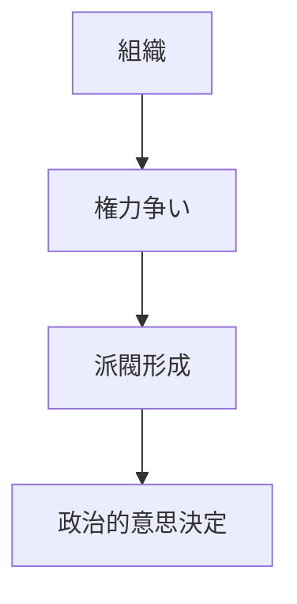

# 内部政治パターン

組織内部で権力や資源を巡って政治的行動が行われる現象。

意思決定が合理性ではなく権力関係によって左右される。

---

# パターン構造

---

# 発生要因

- 権力競争
- 資源配分
- 昇進争い

---

# 結果

- 非合理意思決定
- 組織分裂
- 効率低下

---

# 例

- 政党内部政治
- 企業内派閥争い

---

# 関連

Structure  
[[02_zettelkasten/Zettelkasten Engine/02_knowledge/world_model/pattern/organization/structure/権力構造]]

Pattern  
[[02_zettelkasten/Zettelkasten Engine/02_knowledge/world_model/pattern/organization/pattern/power/派閥形成パターン]]