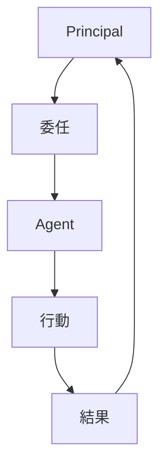
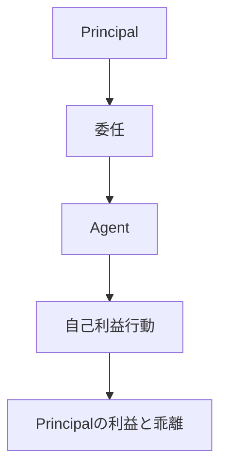
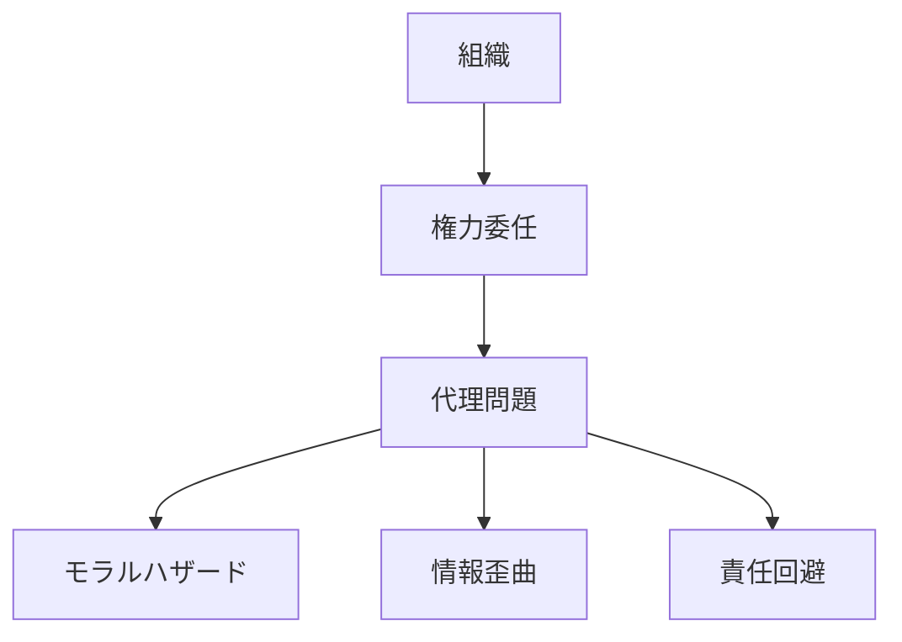

# 代理問題構造

代理問題とは、意思決定を委任した主体（Principal）と、実際に行動する主体（Agent）の利害や情報が一致しないために発生する組織問題の構造である。

組織では、すべての行動をトップが直接行うことはできないため、権限委任が必要になる。

しかしその結果、

- 利害の不一致
- 情報の非対称
- 監視コスト

が発生する。

---

# 基本構造

---

# 問題構造

---

# 代理問題の原因

## 利害不一致

Agentは自分の利益を優先する。

例  
- 経営者 vs 株主  
- 官僚 vs 国民  

---

## 情報非対称

Agentは現場情報を持ち、Principalは完全には把握できない。

---

## 監視コスト

Agentの行動を監視するにはコストがかかる。

---

# 典型例

## 企業

株主 → 経営者

---

## 官僚

国民 → 官僚

---

## 軍隊

政治家 → 軍

---

## 政治

有権者 → 政治家

---

# 解決メカニズム

## インセンティブ設計

報酬を成果と連動させる。

---

## 監視

監査・評価・統制。

---

## 契約

行動ルールの明文化。

---

## 市場規律

競争による淘汰。

---

# 組織の基本問題

代理問題はすべての組織で発生する。

---

# 関連

Structure

[[02_zettelkasten/Zettelkasten Engine/02_knowledge/world_model/pattern/organization/structure/権力構造]]  
[[02_zettelkasten/Zettelkasten Engine/02_knowledge/world_model/pattern/organization/structure/情報構造]]  
[[02_zettelkasten/Zettelkasten Engine/02_knowledge/world_model/pattern/organization/structure/意思決定構造]]  
[[02_zettelkasten/Zettelkasten Engine/02_knowledge/world_model/pattern/organization/structure/インセンティブ構造]]

Pattern

[[02_zettelkasten/Zettelkasten Engine/02_knowledge/world_model/pattern/organization/pattern/behavior/官僚化パターン]]  
[[02_zettelkasten/Zettelkasten Engine/02_knowledge/world_model/pattern/organization/pattern/power/権力集中パターン]]  
[[02_zettelkasten/Zettelkasten Engine/02_knowledge/world_model/pattern/organization/pattern/behavior/組織硬直パターン]]

Hub

[[02_zettelkasten/Zettelkasten Engine/02_knowledge/world_model/pattern/organization/Organization_Pattern_Hub]]