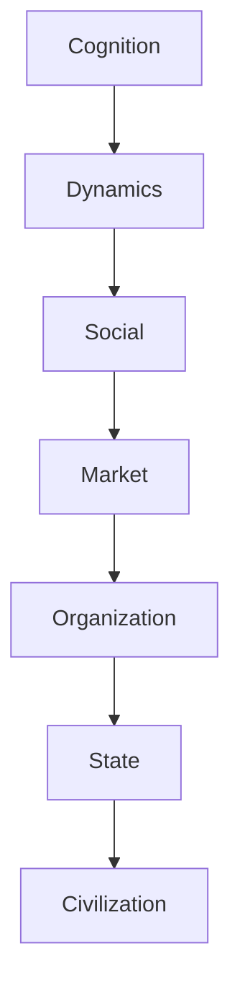
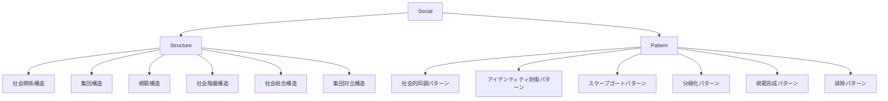

# Social Hub

Social（社会）は、人間同士の関係・集団・規範・制度・階層が形成する相互作用の領域である。

社会では

- 関係
- 集団
- 規範
- 階層
- 対立
- 統合

が相互作用し、個人行動を超えた社会現象が生じる。

この Hub は、社会構造・社会パターンを整理する入口である。

---

# 位置づけ

---

# 全体構造

---

# 読み順

## 最小ルート

1. [[02_zettelkasten/Zettelkasten Engine/02_knowledge/world_model/pattern/social/structure/社会関係構造]]
2. [[02_zettelkasten/Zettelkasten Engine/02_knowledge/world_model/pattern/social/structure/集団構造]]
3. [[02_zettelkasten/未整理/model 1/world_model/03_social/institution/規範構造]]
4. [[02_zettelkasten/Zettelkasten Engine/02_knowledge/world_model/pattern/social/structure/社会階層構造]]

## 対立ルート

1. [[02_zettelkasten/Zettelkasten Engine/02_knowledge/world_model/pattern/social/structure/集団構造]]
2. [[02_zettelkasten/Zettelkasten Engine/02_knowledge/world_model/pattern/cognition/アイデンティティ防衛パターン]]
3. [[02_zettelkasten/Zettelkasten Engine/02_knowledge/world_model/pattern/social/structure/集団対立構造]]
4. [[02_zettelkasten/Zettelkasten Engine/02_knowledge/world_model/pattern/cognition/スケープゴートパターン]]

## 統合ルート

1. [[02_zettelkasten/未整理/model 1/world_model/03_social/institution/規範構造]]
2. [[02_zettelkasten/Zettelkasten Engine/02_knowledge/world_model/pattern/social/structure/社会統合構造]]
3. [[02_zettelkasten/Zettelkasten Engine/02_knowledge/world_model/pattern/social/pattern/規範形成パターン]]

---

# 関連

Pattern  
[[02_zettelkasten/Zettelkasten Engine/02_knowledge/world_model/pattern/cognition/社会的同調パターン]]  
[[02_zettelkasten/Zettelkasten Engine/02_knowledge/world_model/pattern/cognition/パニックパターン]]  
[[02_zettelkasten/Zettelkasten Engine/02_knowledge/world_model/pattern/cognition/情報カスケードパターン]]

Structure  
[[02_zettelkasten/Zettelkasten Engine/02_knowledge/world_model/pattern/state/structure/権力構造]]  
[[02_zettelkasten/Zettelkasten Engine/02_knowledge/world_model/pattern/market/structure/市場ポジション構造]]