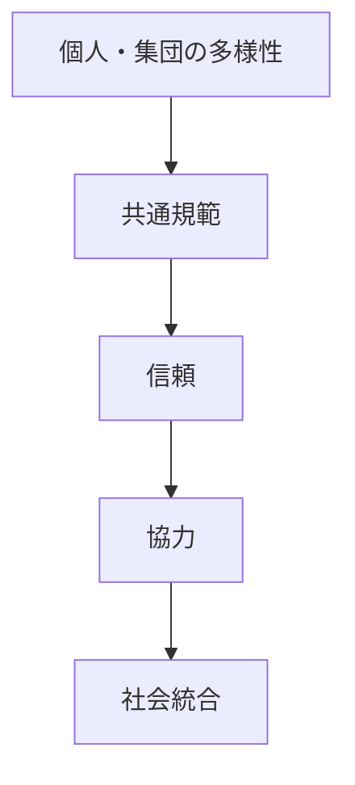

# 社会統合構造

社会統合構造とは、異なる個人や集団が一つの社会として結びつく構造である。

---

# 基本構造

---

# 統合要因

- 共通規範
- 共通利益
- 正統性
- 共同体意識
- 制度

---

# 統合の破綻

- アノミー
- 分極化
- 内戦
- 社会不信

---

# 関連

[[02_zettelkasten/Zettelkasten Engine/02_knowledge/world_model/pattern/social/structure/規範構造]]  
[[正統性構造]]