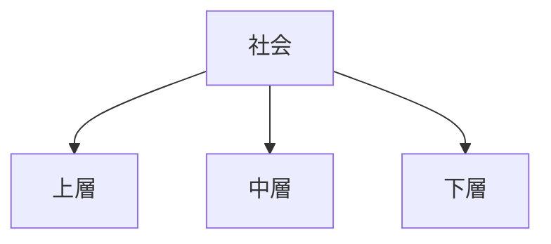

# 社会階層構造

社会階層構造とは、資源・権力・威信の分配差によって社会が上下に分化する構造である。

---

# 基本構造

---

# 階層の基準

- 所得
- 資産
- 教育
- 地位
- 権力

---

# 特徴

- 機会格差を生む
- 再生産されやすい
- 対立の基盤になる

---

# 関連

[[02_zettelkasten/Zettelkasten Engine/02_knowledge/world_model/pattern/social/structure/集団構造]]  
[[02_zettelkasten/Zettelkasten Engine/02_knowledge/world_model/pattern/social/structure/集団対立構造]]