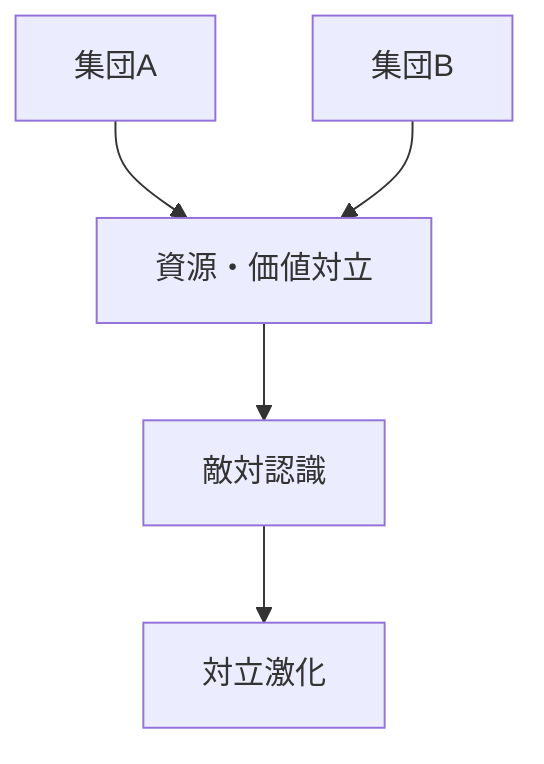

# 集団対立構造

集団対立構造とは、複数の集団が資源・地位・価値観・アイデンティティをめぐって対立する構造である。

---

# 基本構造

---

# 対立要因

- 資源競争
- 階層格差
- 宗教差
- 民族差
- イデオロギー差

---

# 関連

[[02_zettelkasten/Zettelkasten Engine/02_knowledge/world_model/pattern/social/structure/集団構造]]  
[[02_zettelkasten/Zettelkasten Engine/02_knowledge/world_model/pattern/social/structure/社会階層構造]]