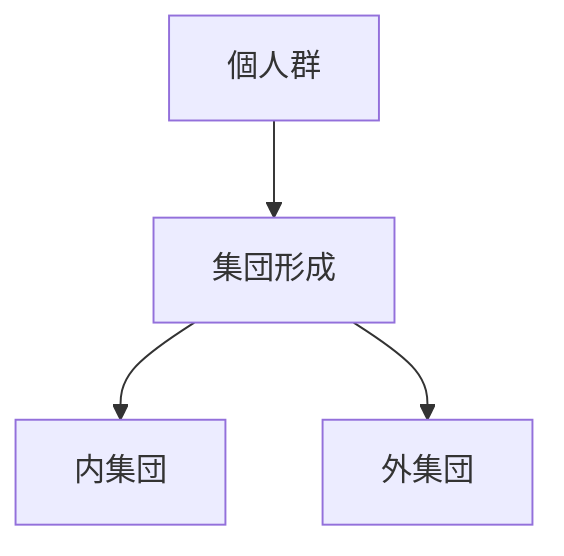

# 集団構造

集団構造とは、複数の個人が共通の目的・所属・関係によってまとまる構造である。

---

# 基本構造

---

# 集団の要素

- 所属
- 境界
- 役割
- 規範
- アイデンティティ

---

# 集団の種類

- 家族
- 地域共同体
- 階級
- 宗教集団
- ファンダム
- nation

---

# 関連

[[02_zettelkasten/Zettelkasten Engine/02_knowledge/world_model/pattern/social/structure/社会関係構造]]  
[[02_zettelkasten/Zettelkasten Engine/02_knowledge/world_model/pattern/social/structure/集団対立構造]]