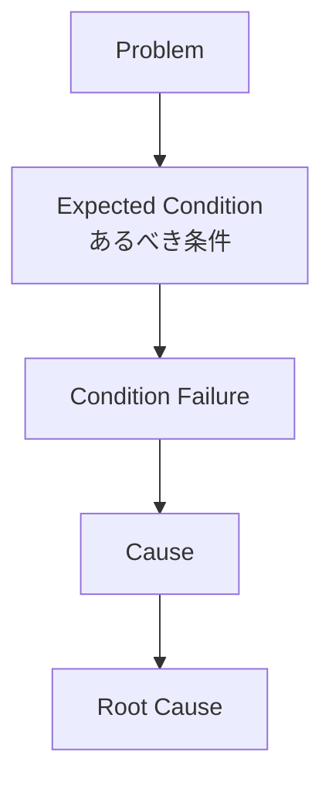
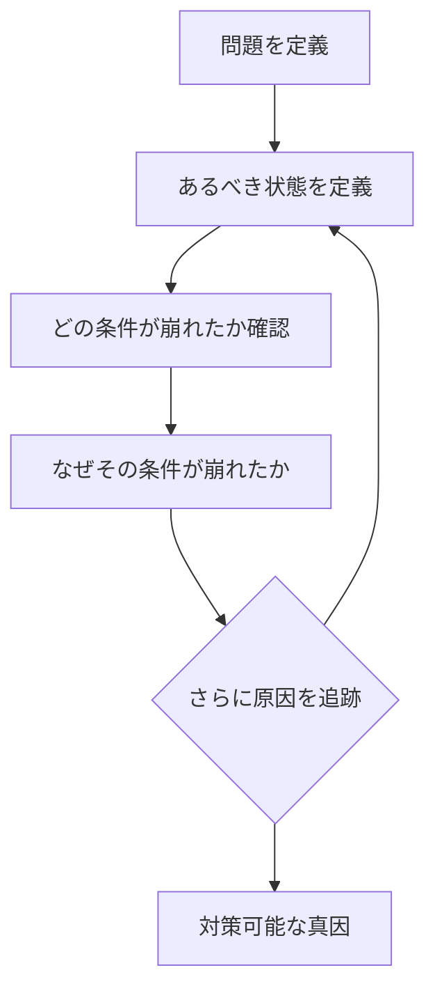

# 概要

Five Whys（なぜなぜ分析）は  
問題の原因を掘り下げ、真因（root cause）を特定する分析フレームワークである。
本来のFive Whysは  、単に「なぜ？」を繰り返す手法ではない。
本質は、あるべき姿のその条件が崩れた点となぜ崩れたかを追跡することである。
問題とは、あるべき状態と実際の状態の差であり、Five Whysはこの差を生んだ原因を掘り下げる。

# 基本構造

分析の焦点は、作用が起きなかった点である。

# 手順

# ポイント
Five Whysでは次を確認する。
- あるべき姿：正常に機能するための条件
- 条件の崩れ：どの条件が欠けたか
- 真因：条件を崩した根本要因
- 
典型例
例：設備停止
- あるべき状態：機械は正常に稼働する

分析
機械停止
↓
なぜ
潤滑不足
↓
なぜ
ポンプ故障
↓
なぜ
メンテナンス未実施
↓
なぜ
保守計画が存在しない

真因：保守管理システムの欠如

# よくある失敗
Five Whysの典型的失敗
- 人の責任に帰着：作業者がミスした
- 推測ベース：多分こうだった
- 5回にこだわる：回数は固定ではない。

# 適用条件
## Five Whysが有効な問題
- 単一プロセスの問題
- 因果が比較的単純
- 再発防止が目的
## 不向きな問題
- 多要因問題
- 不確実性が高い問題

# 他フレームとの関係
|フレーム|役割|
|---|---|
|Five Whys|作用断絶の探索|
|Causal Chain Analysis|因果連鎖|
|Root Cause Analysis|真因確定|
|Bottleneck Analysis|制約特定|

# 重要性
Five Whysは、問題から作用の断絶を発見し、原因を特定するための最も基本な原因分析手法である。

# 関連ノート
- [[02_zettelkasten/Zettelkasten Engine/02_process/methods/analysis/因果連鎖分析]]
- [[02_zettelkasten/Zettelkasten Engine/02_process/methods/analysis/根因分析]]
- [[02_zettelkasten/Zettelkasten Engine/02_process/methods/analysis/ボトルネック分析]]
- [[02_zettelkasten/Zettelkasten Engine/02_process/methods/analysis/00 Analysis Framework hub]]
