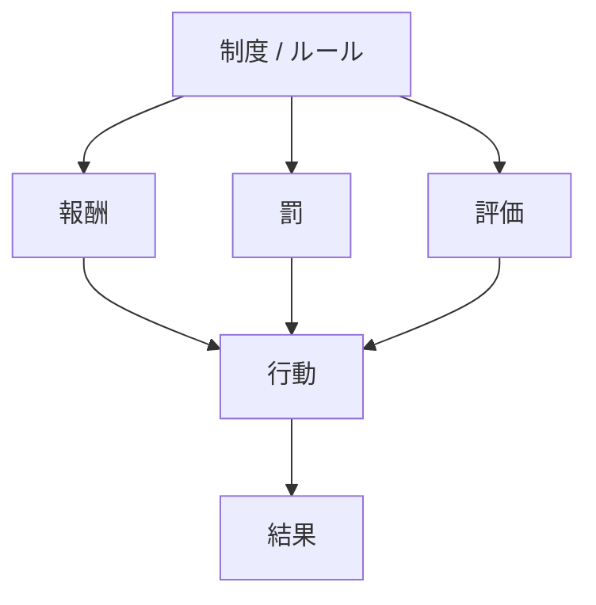
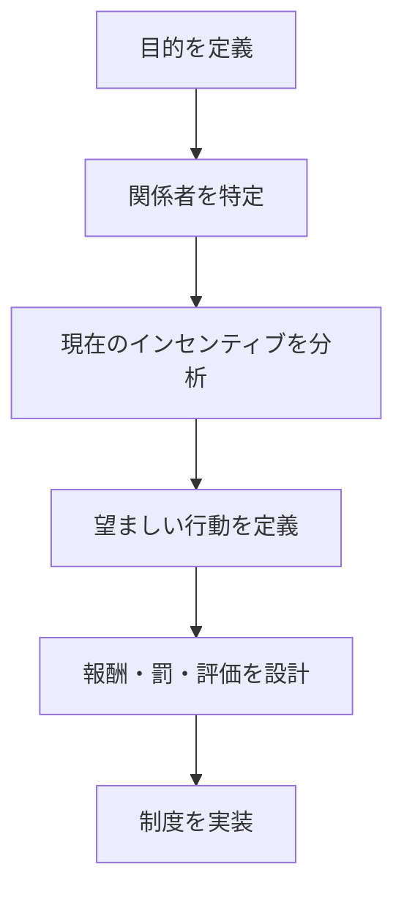

# 概要

Incentive Designは、望ましい行動を引き出すために報酬・罰・評価の仕組みを設計する分析フレームワークである。

多くの問題は能力ではなく **インセンティブの不整合**から発生する。

人や組織は、与えられた評価や報酬に適応して行動するため、
制度設計ではインセンティブ構造の設計が重要になる。

---

# 基本構造

制度は行動を直接制御するのではなく、

インセンティブ  
↓  
行動  
↓  
結果

という経路で影響する。
# 手順

# 典型問題

インセンティブ設計が失敗すると次の問題が起きる。

- [[02_zettelkasten/Zettelkasten Engine/01_knowledge/world_model/model/social/incentive/モラルハザード]]    
- [[02_zettelkasten/Zettelkasten Engine/01_knowledge/world_model/model/social/incentive/短期合理]]    
- [[02_zettelkasten/Zettelkasten Engine/01_knowledge/world_model/model/social/incentive/評価指標の歪み]]    
- [[02_zettelkasten/Zettelkasten Engine/02_process/methods/analysis/代理人問題]]    

---

# 応用領域

- 組織管理    
- 公共政策    
- プラットフォーム設計    
- 市場制度

---

# 関連ノート

- [[02_zettelkasten/Zettelkasten Engine/02_process/methods/analysis/ステークホルダー分析]]    
- [[02_zettelkasten/Zettelkasten Engine/02_process/methods/analysis/代理人問題]]    
- [[02_zettelkasten/Zettelkasten Engine/02_process/methods/analysis/トレードオフ分析]]    
- [[02_zettelkasten/Zettelkasten Engine/02_process/methods/analysis/費用便益分析]]