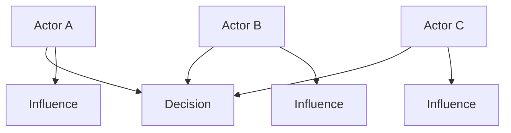
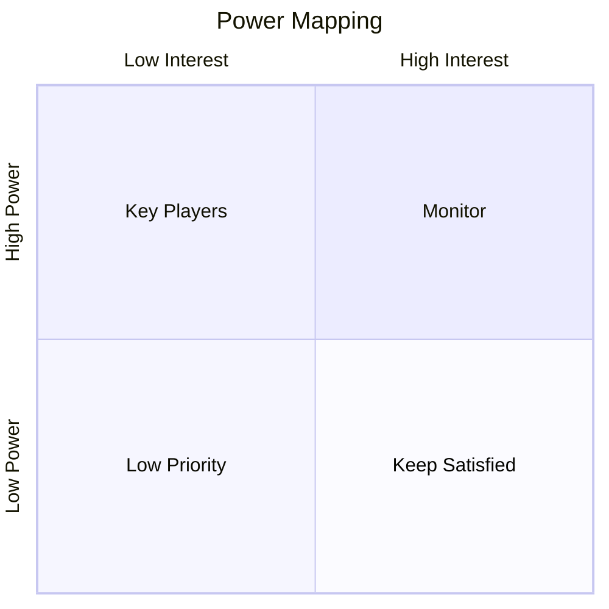
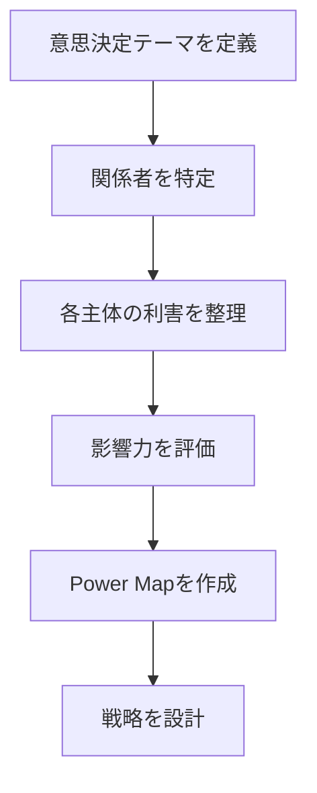

# 概要

Power Mappingは、意思決定や制度の背後に存在する権力の分布と影響力の関係を可視化する分析フレームワークである。
組織や社会の多くの問題は、公式な制度ではなく 、非公式な影響力や利害関係によって決定される。
Power Mappingは、
- 誰が影響力を持つか
- 誰が意思決定を左右するか
- 誰が反対・支持するか
を明らかにする。

---

# Power Mappingの基本構造

意思決定は公式な権限だけでなく、影響力 + 利害 + ネットワーク によって決まる。

---

# 典型的マップ（Influence × Interest）

| 区分             | 意味      |
| -------------- | ------- |
| Key Players    | 高影響・高関心 |
| Keep Satisfied | 高影響・低関心 |
| Monitor        | 低影響・高関心 |
| Low Priority   | 低影響・低関心 |

---

# 手順

---

# 分析ポイント

Power Mappingでは次を確認する。

## 影響力

誰が実際の決定権を持つか

## 利害

誰が利益・損失を受けるか

## 同盟

誰と誰が協力する可能性があるか

## 反対勢力

どこに抵抗が生まれるか

---

# 典型例

### 例：組織改革
- 経営陣  
- 管理職  
- 現場  
- 労働組合

### 例：政策
- 政府  
- 企業  
- 市民団体  
- メディア

---

# 他フレームとの関係

| フレーム                           | 役割      |
| ------------------------------ | ------- |
| [[02_zettelkasten/Zettelkasten Engine/02_process/methods/analysis/ステークホルダー分析]]    | 利害関係の把握 |
| [[02_zettelkasten/Zettelkasten Engine/02_process/methods/analysis/パワーマッピング]]           | 権力構造の把握 |
| [[02_zettelkasten/Zettelkasten Engine/02_process/methods/analysis/インセンティブ設計]]        | 行動の誘導   |
| [[02_zettelkasten/Zettelkasten Engine/02_process/methods/analysis/代理人問題]] | 委任関係    |

---

# 重要性

多くの政策・改革が失敗する理由は、権力構造を無視することである。
Power Mappingは、誰が意思決定を動かすのかを可視化する。

---

# 関連ノート

- [[02_zettelkasten/Zettelkasten Engine/02_process/methods/analysis/ステークホルダー分析]]    
- [[02_zettelkasten/Zettelkasten Engine/02_process/methods/analysis/インセンティブ設計]]
- [[02_zettelkasten/Zettelkasten Engine/02_process/methods/analysis/代理人問題]]
- [[02_zettelkasten/Zettelkasten Engine/02_process/methods/analysis/00 Analysis Framework hub]]