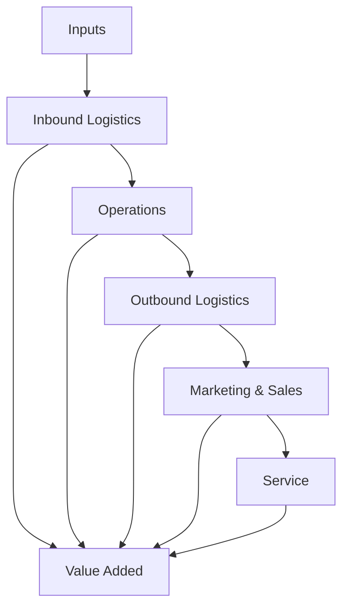

# 概要

Value Chain Analysisは、組織や企業の活動を分解し、どこで価値が生まれ、どこでコストが発生しているかを分析するフレームワークである。
競争優位は単一の活動ではなく、活動の連鎖によって形成される。
そのため、組織のパフォーマンスは 各活動 + 活動の連結によって決まる。

---

# Value Chainの基本構造


企業は複数の活動の連鎖によって価値を生む。

---

# 基本モデル（Porter）

企業活動は次の2種類に分類できる。

## 主活動

- Inbound Logistics（入庫物流）    
- Operations（生産）    
- Outbound Logistics（配送）    
- Marketing & Sales（販売）    
- Service（サービス）

## 支援活動

- Firm Infrastructure（組織管理）    
- Human Resource Management（人材）    
- Technology Development（技術）    
- Procurement（出庫物流）

---

# 手順
```
flowchart TD
    A[対象組織を定義] --> B[活動を分解]
    B --> C[各活動のコストを把握]
    C --> D[各活動の価値を把握]
    D --> E[競争優位の源泉を特定]
    E --> F[改善・戦略設計]
```

---
# 分析ポイント

Value Chain Analysisでは次を確認する。

## 価値の源泉

- どの活動が顧客価値を生むか    

## コスト構造

- どの活動がコストを支配するか    

## 競争優位

- 差別化    
- 低コスト    

---

# 典型的な洞察

Value Chain Analysisにより次が分かる。

- 利益を生む活動    
- 無駄な活動    
- 外部委託可能な活動    
- ボトルネック    

---

# 他フレームとの関係

| フレーム                        | 役割   |
| --------------------------- | ---- |
| [[02_zettelkasten/Zettelkasten Engine/02_process/methods/analysis/価値連鎖分析]]  | 活動構造 |
| [[02_zettelkasten/Zettelkasten Engine/02_process/methods/analysis/ボトルネック分析]] | 制約   |
| [[02_zettelkasten/Zettelkasten Engine/02_process/methods/analysis/ステークホルダー分析]] | 利害   |
| [[02_zettelkasten/Zettelkasten Engine/02_process/methods/analysis/トレードオフ分析]]   | バランス |

---

# 適用例

例：観光業

観光資源  
↓  
アクセス  
↓  
宿泊  
↓  
体験  
↓  
消費

例：バス会社

車両  
↓  
運行  
↓  
販売  
↓  
サービス

---

# 重要性

多くの問題は活動構造を理解しないことで起きる。
Value Chain Analysisは、どこで価値が生まれるかを可視化する。

---

# 関連ノート

- [[02_zettelkasten/Zettelkasten Engine/02_process/methods/analysis/ボトルネック分析]]    
- [[02_zettelkasten/Zettelkasten Engine/02_process/methods/analysis/トレードオフ分析]]    
- [[02_zettelkasten/Zettelkasten Engine/02_process/methods/analysis/ステークホルダー分析]]    
- [[02_zettelkasten/Zettelkasten Engine/02_process/methods/analysis/システムマッピング]]    
- [[02_zettelkasten/Zettelkasten Engine/02_process/methods/analysis/00 Analysis Framework hub]]