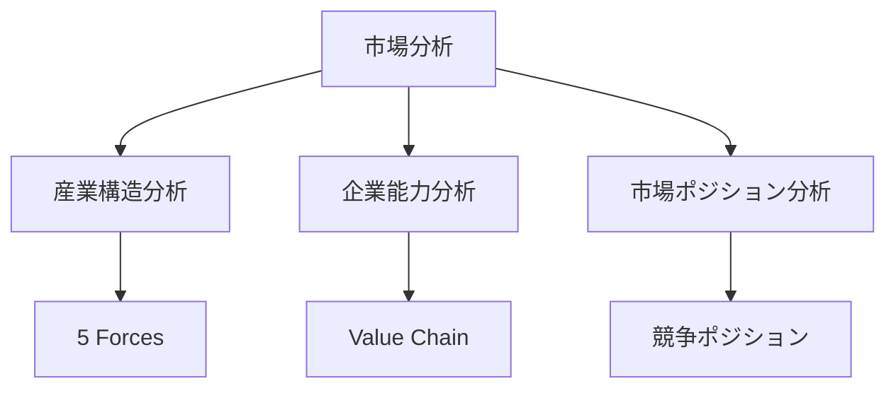
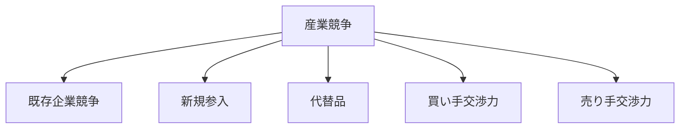
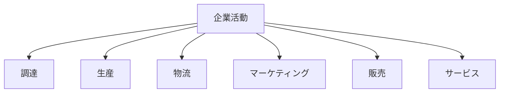
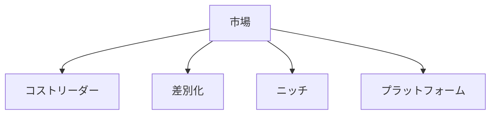
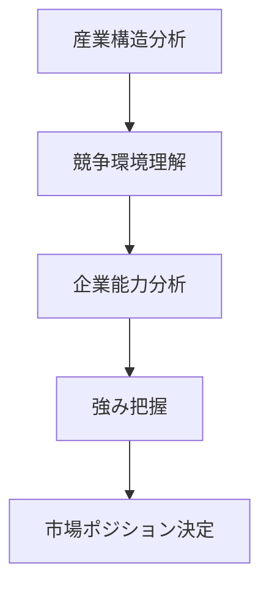

# 市場分析フレームワーク

市場分析フレームワークとは、市場の構造・競争・企業能力を体系的に分析するための構造である。

市場分析は主に

- 産業構造
- 企業内部能力
- 市場ポジション

の三つの視点から行われる。

---

# 全体構造

---

# 1 産業構造分析（5 Forces）

産業の競争環境を分析する構造。

## 既存企業競争

企業間の競争の強さ。

影響要因

- 企業数
- 市場成長
- 差別化

---

## 新規参入

新しい企業が市場に参入する可能性。

関連

[[02_zettelkasten/Zettelkasten Engine/01_knowledge/world_model/meta/pattern/market/structure/参入障壁構造]]

---

## 代替品

他の製品・サービスによる置き換え。

例

- 飛行機 ↔ 新幹線
- DVD ↔ ストリーミング

---

## 買い手交渉力

顧客が価格や条件に影響を与える力。

---

## 売り手交渉力

供給者が価格や条件に影響する力。

---

# 2 企業能力分析（Value Chain）

企業内部の活動を分析する構造。

---

## 主活動

- 調達
- 生産
- 物流
- マーケティング
- 販売
- サービス

---

## 支援活動

- 技術開発
- 人材管理
- インフラ
- 経営

---

# 3 市場ポジション分析

企業が市場でどの位置にいるかを分析する。

詳細

[[02_zettelkasten/Zettelkasten Engine/01_knowledge/world_model/pattern/market/structure/市場ポジション構造]]

---

# 市場分析の流れ

---

# 関連

Structure

[[02_zettelkasten/Zettelkasten Engine/01_knowledge/world_model/meta/pattern/market/dynamics/競争構造]]  
[[02_zettelkasten/Zettelkasten Engine/01_knowledge/world_model/meta/pattern/market/structure/参入障壁構造]]  
[[02_zettelkasten/Zettelkasten Engine/01_knowledge/world_model/meta/pattern/market/structure/寡占構造]]  
[[02_zettelkasten/Zettelkasten Engine/01_knowledge/world_model/pattern/market/structure/市場ポジション構造]]

Pattern

[[02_zettelkasten/Zettelkasten Engine/01_knowledge/world_model/pattern/market/pattern/寡占形成パターン]]  
[[02_zettelkasten/Zettelkasten Engine/01_knowledge/world_model/pattern/market/pattern/差別化パターン]]  
[[02_zettelkasten/Zettelkasten Engine/01_knowledge/world_model/pattern/market/pattern/価格戦争パターン]]

Hub

[[02_zettelkasten/Zettelkasten Engine/01_knowledge/world_model/pattern/market/Market_Hub]]