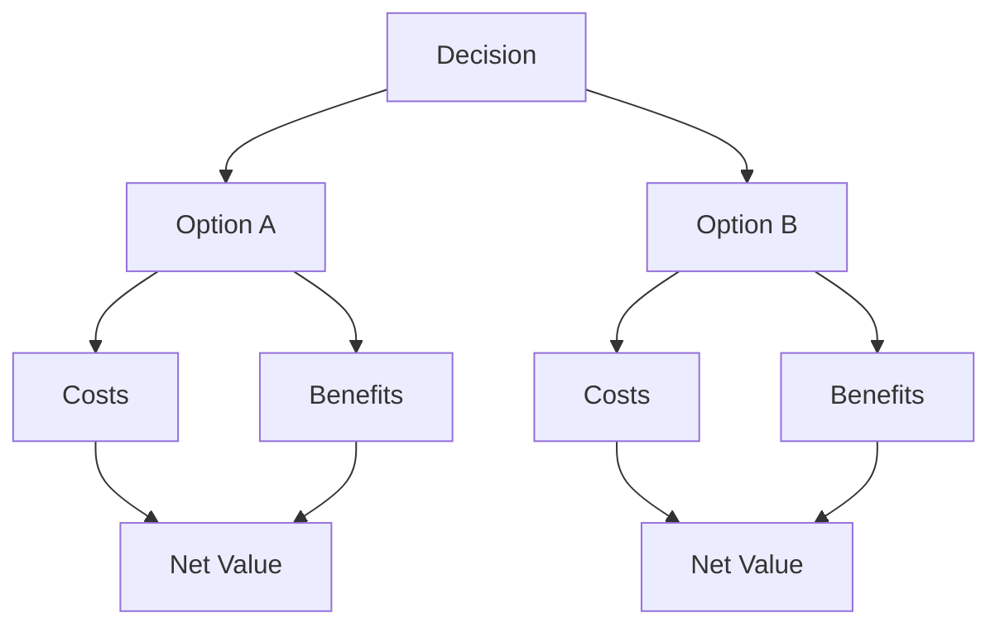
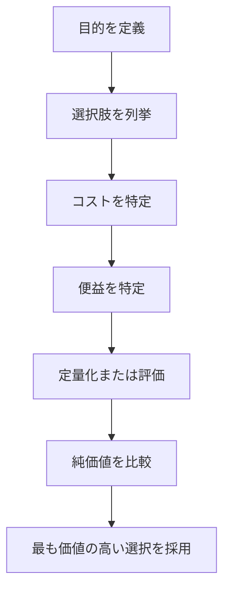

# 概要

Cost-Benefit Analysisは、ある行動や政策の費用（Cost）と便益（Benefit）を比較し、純利益を評価する分析フレームワークである。  
意思決定では、行動が生む利益と負担を定量または定性的に比較し、  実行する価値があるかを判断することが重要である。
Cost-Benefit Analysisは特に次のような意思決定で使われる。

- 投資判断  
- 政策評価  
- プロジェクト選択  
- 業務改善  

---

# Cost-Benefitの基本構造

意思決定では、各選択肢の Net Value = Benefit − Cost を比較する。
# 手順

# 評価の観点

Cost-Benefit Analysisでは次の要素を評価する。

## コスト

- 初期投資    
- 維持費    
- 機会費用    
- リスク
## ベネフィット

- 利益    
- 生産性向上    
- 時間削減    
- 社会的価値    

---

# Trade-off Analysisとの違い

| 分析                    | 目的            |
| --------------------- | ------------- |
| Trade-off Analysis    | 複数目標のバランス     |
| Cost-Benefit Analysis | 純利益の最大化・利益の比較 |

---

# 重要性

Cost-Benefit Analysisを行わないと次の問題が起きる。

- 感覚で意思決定する    
- 見えないコストを無視する    
- 小さな利益のために大きな負担を受ける

---

# 適用例

| 例    | Benefit   | Cost         |
| ---- | --------- | ------------ |
| 新規事業 | 売上・ブランド向上 | 初期投資・人件費・リスク |
| 公共政策 | 社会的利益     | 税収・支出・規制コスト  |

---

# 関連ノート

- [[02_zettelkasten/Zettelkasten Engine/02_process/methods/analysis/トレードオフ分析]]    
- [[02_zettelkasten/Zettelkasten Engine/02_process/methods/analysis/ステークホルダー分析]]    
- [[02_zettelkasten/Zettelkasten Engine/02_process/methods/analysis/ボトルネック分析]]    
- [[02_zettelkasten/Zettelkasten Engine/02_process/methods/analysis/意思決定フレームワーク]]