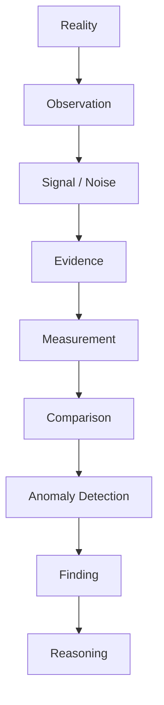
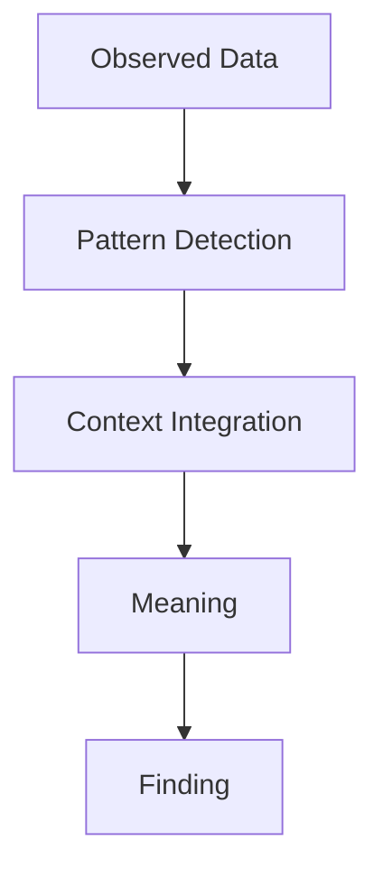
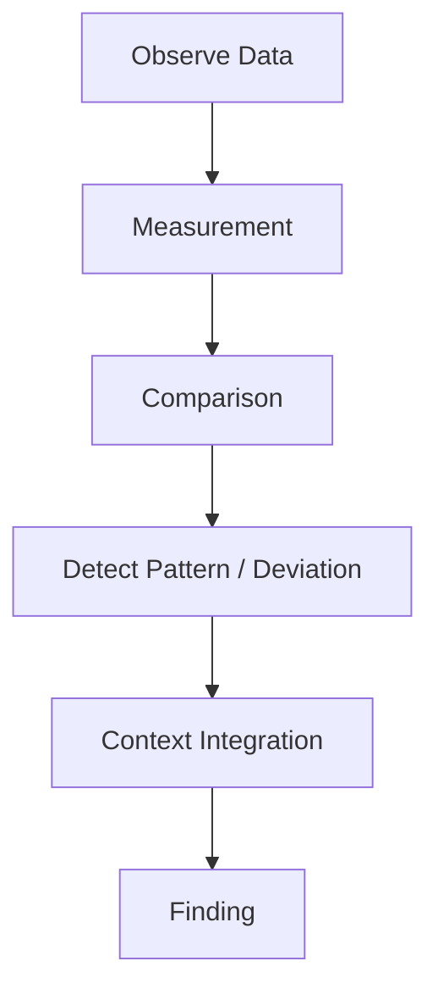

# Finding Structure

Finding Structure は、Observation・Measurement・Comparison の結果から意味のある事実（insight）を抽出する構造である。
Observation が「現実の記録」だとすれば、Finding は「そこから読み取れる状態」である。

---

# 概要

現実のデータはそのままでは断片的である。

Observation  
- 数値  
- 事例  
- 発言  
- 行動  

これらを

- パターン
- 異常
- 比較
- 文脈

を通して整理すると **Finding（意味ある発見）**になる。

---

# 思考OS内の位置

# 基本構造

# Findingの構成要素

## 1. Pattern（パターン）

データの中に繰り返しや傾向がある。

例
- 売上の長期減少    
- 同種の事故の反復    
- 特定層の顧客離脱    

---

## 2. Deviation（逸脱）

平常状態からのズレ。

例
- 急激な売上減    
- 突然の離職増    
- 市場価格の異常変動    

---

## 3. Relationship（関係）

複数変数の関連。

例
- 広告費と問い合わせの連動    
- 人員減と事故率上昇    
- 金利上昇と投資減    

---

## 4. Context（文脈）

状況を加味した意味づけ。

例
- 季節要因    
- 政策変更    
- 技術変化    
- 社会環境    

---

# Findingの主要類型

## 1. Trend Finding

長期的傾向。

例
- 市場縮小    
- 人口減少    
- 技術普及    

---

## 2. Structural Finding

構造変化。

例
- 顧客層変化    
- 産業構造転換    
- 競争環境変化    

---

## 3. Behavioral Finding

行動パターン。

例
- 顧客の購買パターン    
- 組織の意思決定癖    
- 政治的投票行動    

---

## 4. Anomaly Finding

異常事象。

例
- 不自然な価格急騰    
- 事故急増    
- 支持率急落    

---

## 5. Constraint Finding

制約の発見。

例
- 人材不足    
- 資金不足    
- 技術限界    
- 制度制約    

---

# Findingの生成プロセス

# 良いFindingの条件

- データに基づく    
- 再現可能    
- 文脈を説明できる    
- 意思決定に使える    
- 原因仮説を生む    

---

# 悪いFinding

## 1. ノイズ解釈

偶然の変動を意味あるものと誤認する。

## 2. 文脈欠如

数字だけで解釈する。

## 3. 因果誤認

相関を原因と誤解する。

## 4. 過剰一般化

単一事例を普遍化する。

---

# FindingとObservationの違い

Observation

- 生データ    
- 記録    

Finding

- 解釈された事実    
- 状態認識    

例

- Observation  「今月売上 900万円」
- Finding  「売上が前年同月比で大きく減少している」

---

# FindingとReasoningの違い

- Finding 「何が起きているか」
- Reasoning「なぜ起きているか」

例

- Finding「顧客流入が減少している」
- Reasoning「広告停止が原因の可能性」

---

# 例

## 例1：ビジネス

Observation

- 売上減    
- 問い合わせ減    

Measurement

- 前年同月比 -18%    

Comparison

- 業界平均 -3%    

Finding

- 当社の集客機能が大きく低下している    

---

## 例2：歴史

Observation

- 複数都市で同時蜂起    

Finding

- 社会不満が広範囲に蓄積していた    

---

## 例3：組織

Observation

- 3部署で同時に離職    

Finding

- 組織文化または評価制度に問題の可能性

# Findingのテンプレート
Observation:  
Measurement:  
Comparison:  
Pattern / Deviation:  
Context:  
Finding:

# 関連ノート

[[Measurement]]  
[[指標構造]]  
[[比較構造]]  
[[異常検出構造]]  
[[パターン構造]]  
[[シグナルノイズフィルター]]  
[[02_zettelkasten/Zettelkasten Engine/02_process/methods/analysis/根因分析|根因分析]]