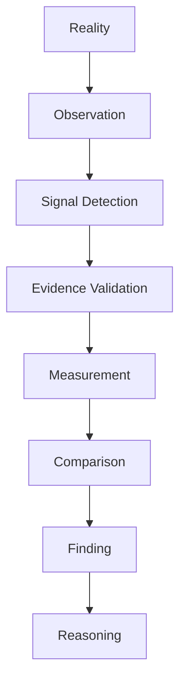
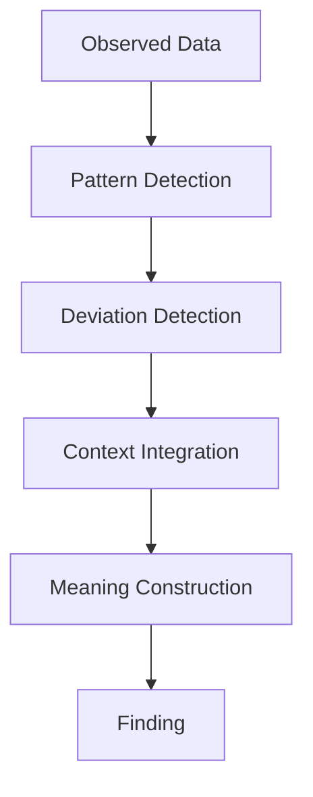
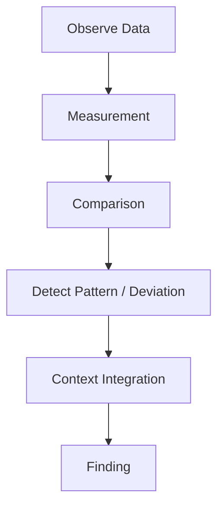

# Finding Structure

Finding Structure は、Observation から得られたデータ・指標・比較結果を統合し、意味を持つ状態認識（insight）を形成する構造である。

Observation が「事実の記録」であるのに対し、Finding は「その事実が示している状態」である。

---

# 概要

現実のデータはそのままでは断片的であり意味を持たない。

例
- 売上 900万円
- 離職率 8%
- 事故 3件

これらは比較・文脈・パターン認識を通して初めて意味を持つ。
その意味形成の結果が **Finding** である。

---

# 思考OS内の位置

# 基本構造

# Findingの構成要素

## Pattern（パターン）

繰り返し現れる傾向。

例
- 売上の継続的減少    
- 同種クレームの反復    
- 特定顧客層の離脱    

---

## Deviation（逸脱）

通常状態からのズレ。

例
- 急激な売上減    
- 離職率急上昇    
- 異常価格    

---

## Relationship（関係）

複数要素の関連。

例
- 広告停止 → 問い合わせ減    
- 人員不足 → 事故増    
- 金利上昇 → 投資減    

---

## Context（文脈）

外部条件による意味づけ。

例
- 季節要因    
- 政策変更    
- 技術革新    
- 社会変化    

---

# Findingの主要類型

## Trend Finding

長期的変化。

例
- 市場縮小    
- 人口減少    
- 技術普及    

---

## Structural Finding

構造変化。

例
- 顧客層変化    
- 競争構造変化    
- 組織文化変化    

---

## Behavioral Finding

行動パターン。

例
- 消費行動変化    
- 投票行動    
- 組織意思決定傾向    

---

## Anomaly Finding

異常事象。

例
- 事故急増    
- 市場暴騰    
- 支持率急落    

---

## Constraint Finding

制約の発見。

例
- 人材不足    
- 資金制約    
- 技術制約    
- 制度制約    

---

# Finding生成プロセス

# 良いFindingの条件

- データに基づく    
- 再現可能    
- 文脈と整合する    
- 意思決定に利用できる    
- 原因仮説を生成できる    

---

# 悪いFinding

## Noise Interpretation

偶然変動を意味と誤認する。

---

## Context Ignorance

文脈を無視する。

---

## Correlation Fallacy

相関を因果と誤解する。

---

## Overgeneralization

単一事例から一般化する。

---

# FindingとObservationの違い

Observation  
事実の記録

Finding  
意味ある状態認識

例

Observation  
「売上900万円」

Finding  
「売上が前年同月比で大きく減少している」

---

# FindingとReasoningの違い

Finding  
何が起きているか

Reasoning  
なぜ起きているか

例

Finding  
顧客流入が減少

Reasoning  
広告停止が原因の可能性

---

# Findingテンプレート

Observation:  
Measurement:  
Comparison:  
Pattern / Deviation:  
Context:  
Finding:

---

# 例

## ビジネス

Observation  
売上減少

Measurement  
前年比 -18%

Comparison  
業界平均 -3%

Finding  
自社の集客機能が低下している

---

## 歴史研究

Observation  
複数都市で同時蜂起

Finding  
社会不満が広範囲に蓄積していた

---

## 組織分析

Observation  
複数部署で離職

Finding  
評価制度または文化に問題の可能性

---

# 関連ノート

[[信号探知構造]]  
[[シグナルノイズフィルター]]  
[[根拠構造]]
[[Measurement]]  
[[比較構造]]  
[[異常検出構造]]  
[[02_zettelkasten/Zettelkasten Engine/02_process/methods/analysis/根因分析|根因分析]]