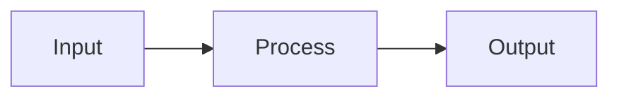

# 概要
システムマッピングは、システムを構成する要素と、その関係を可視化する分析フレームワークである。
多くの問題は、個別要素ではなく要素間の関係によって生まれる。
システムマッピングは、構造を理解するための図式化手法である。
# 基本構造

# 構成要素
| 要素          | 意味  |
| ----------- | --- |
| Actor       | 主体  |
| Process     | 活動  |
| Resource    | 資源  |
| Information | 情報  |
| Outcome     | 結果  |
# 基本モデル

# フィードバック構造

# 目的
- 構造理解
- 問題発見
- 改善点特定
- 全体最適化
# 導入の理由
多くの失敗は、 個別改善・部分最適によって起きる。
システムマッピングは、全体構造を可視化することでこれを防ぐ。
# 関連ノート
- [[02_zettelkasten/Zettelkasten Engine/03_process/methods/analysis/ステークホルダー分析]]
- [[02_zettelkasten/Zettelkasten Engine/03_process/methods/analysis/状態遷移モデル]]
- [[02_zettelkasten/Zettelkasten Engine/03_process/methods/analysis/ボトルネック分析]]