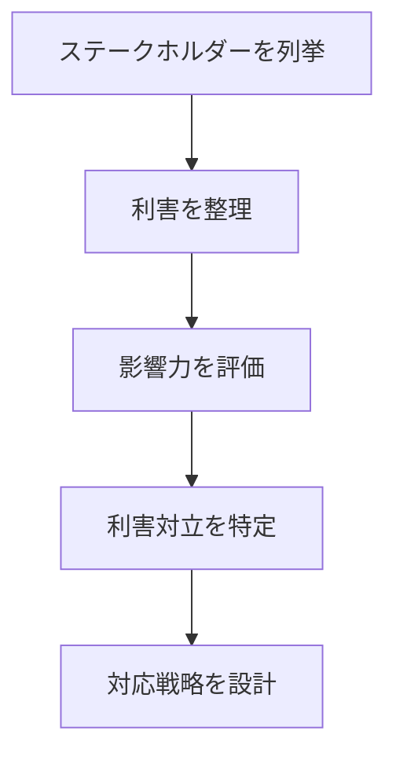
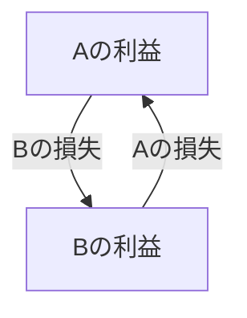

# 概要
ステークホルダー分析は、ある問題・事業・組織に関係する利害関係者（stakeholder）を特定し、その利害と影響力を分析するフレームワークである。
多くの問題は、技術問題ではなく利害調整問題である。
ステークホルダー分析は、「誰が何を望み、どれだけ影響力を持つか」を整理する。
# ステークホルダー
Stakeholderとは、ある意思決定やシステムから影響を受ける、または影響を与える主体である。
例
- 顧客
- 従業員
- 経営者
- 政府
- 取引先
# 基本構造
Stakeholder Analysisは、次の3つを整理する。

| 要素       | 意味  |
| -------- | --- |
| Actor    | 主体  |
| Interest | 利害  |
| Power    | 影響力 |
# Stakeholderマップ

基本モデル
Actor  
├ interest  
├ incentive  
└ power

---

# Power × Interest マトリクス

最も一般的な整理方法

| |Interest低|Interest高|
|---|---|---|
|Power高|監視対象|重要管理|
|Power低|最低限対応|情報共有|

---

# Stakeholderの典型分類

## Decision Maker
意思決定者

例
- 経営者
- 管理職

---

## Influencer

影響力を持つ主体

例
- ベテラン社員
- 専門家
- 政治家

---

## Executor

実行主体

例
- 従業員
- オペレーター

---

## Beneficiary

利益を受ける主体

例
- 顧客
- 市民

---

# 分析手順

# 利害の例

|Stakeholder|Interest|
|---|---|
|経営者|利益|
|従業員|安定|
|顧客|品質|
|政府|規制遵守|

# Stakeholderの衝突

多くの問題は

# 応用
- 組織政治  
- 事業戦略  
- 政策分析  
- プロジェクト管理
# 関連ノート  
- [[Power Structure]]  
- [[Incentive Design]]  
- [[02_zettelkasten/Zettelkasten Engine/03_process/methods/analysis/トレードオフ分析]]