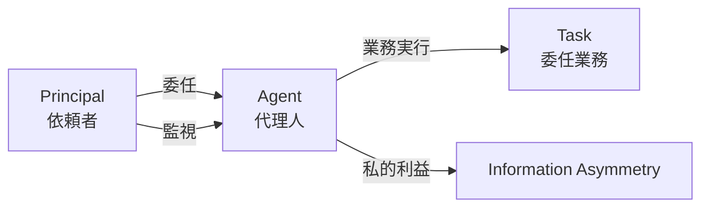
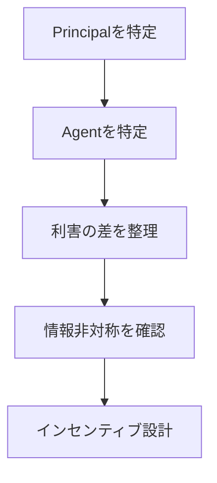

# 概要

Principal–Agent Problemは、委任関係（delegation）において依頼者（Principal）と実行者（Agent）の利害や情報が一致しないことで発生する問題を分析するフレームワークである。
多くの組織・市場・政治制度は、直接統治ではなく Principal → Agent という委任構造で運営される。
しかし、
- 利害の不一致
- 情報非対称
- 監視コスト
によって、AgentがPrincipalの利益に反する行動を取る可能性が生じる。

---

# 基本構造

委任構造では、目標の委任と行動の間に 利害差 + 情報非対称が生じる。

---

# 問題の典型形

## モラルハザード

Agentが努力を怠る

例
- 会社 → 従業員  
- 株主 → 経営者

---

## 逆選択

能力の低いAgentが選ばれる

例
- 保険  
- 採用

---

## 目標不一致

Agentが別の目的を追う

例
- 官僚 → 組織拡大  
- 政治家 → 再選

---
# 手順

---

# 解決手段

Principal–Agent Problemの典型的解決策

## インセンティブ設計
- 成果連動報酬
## 監視
- 監査  
- 評価制度
## 契約
- 義務・責任の明確化
## シグナル
- 能力証明

---

# 典型例

## 企業
株主 → 経営者
問題：経営者の自己利益

---

## 政治
国民 → 政治家
問題：再選行動

---

## 組織

経営者 → 管理職 → 現場
問題：多層代理問題

---

# 他フレームとの関係

| フレーム                           | 役割    |
| ------------------------------ | ----- |
| [[Information Asymmetry]]      | 情報格差  |
| [[02_zettelkasten/Zettelkasten Engine/03_process/methods/analysis/信号分析]]         | 情報の推定 |
| [[02_zettelkasten/Zettelkasten Engine/03_process/methods/analysis/代理人問題]] | 委任問題  |
| [[02_zettelkasten/Zettelkasten Engine/03_process/methods/analysis/インセンティブ設計]]        | 行動調整  |

---

# 重要性

現代の組織・政治・市場はほとんどが委任システムである。
Principal–Agent Problemは、なぜ組織が非効率になるのかを説明する基本理論である。

---

# 関連ノート

- [[02_zettelkasten/Zettelkasten Engine/03_process/methods/analysis/信号分析]]    
- [[02_zettelkasten/Zettelkasten Engine/03_process/methods/analysis/インセンティブ設計]]
- [[02_zettelkasten/Zettelkasten Engine/03_process/methods/analysis/ステークホルダー分析]]
- [[02_zettelkasten/Zettelkasten Engine/03_process/methods/analysis/00 Analysis Framework hub]]