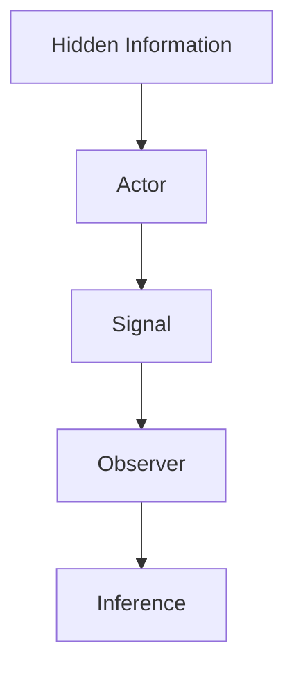
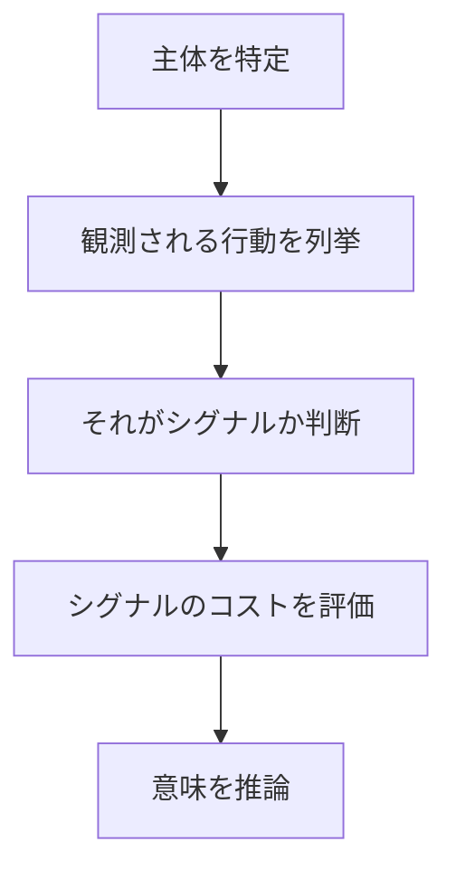

# 概要

Signal Analysisは、主体が発するシグナル（signal）を分析することで隠れた情報や意図を推測するフレームワークである。
多くの意思決定では、主体の能力・意図・品質は完全には観測できない。
そのため主体は、
- 行動
- コストの高い選択
- 公表情報
を通じてシグナルを発する。

Signal Analysisは
- どの行動がシグナルか
- それが何を意味するか
- シグナルが信頼できるか
を分析する。

---

# シグナルの基本構造

情報は直接観測できないため、行動から発せられるシグナルを推論することによって判断される。

---

# 手順

---

# 分析のポイント

Signal Analysisでは次を確認する。

## 情報非対称

誰がどの情報を持っているか

## シグナルのコスト

偽装するコストが高いほど信頼性が高い

## 観測者の解釈

受け手がどう解釈するか

---

# シグナルの典型例

## 市場

高価格  
↓  
高品質のシグナル

## 教育

学位  
↓  
能力のシグナル

## 採用

ポートフォリオ  
↓  
能力のシグナル

---

# 強いシグナルと弱いシグナル

|種類|特徴|
|---|---|
|強いシグナル|偽装コストが高い|
|弱いシグナル|模倣が容易|

例
### 強いシグナル  
- 研究実績  
- 長期投資  
  
### 弱いシグナル  
- 自己申告  
- 広告

---

# 他フレームとの関係

| フレーム                           | 役割      |
| ------------------------------ | ------- |
| [[Information Asymmetry]]      | 情報格差    |
| [[02_zettelkasten/Zettelkasten Engine/03_process/methods/analysis/信号分析]]         | 情報の読み取り |
| [[02_zettelkasten/Zettelkasten Engine/03_process/methods/analysis/代理人問題]] | 委任関係    |
| [[02_zettelkasten/Zettelkasten Engine/03_process/methods/analysis/ステークホルダー分析]]    | 利害構造    |

---

# 重要性

多くの意思決定は不完全情報の下で行われる。
Signal Analysisは観測できる行動から隠れた情報を推測するための方法である。

---

# 関連ノート

- [[02_zettelkasten/Zettelkasten Engine/03_process/methods/analysis/代理人問題]]    
- [[Information Asymmetry]]    
- [[02_zettelkasten/Zettelkasten Engine/03_process/methods/analysis/ステークホルダー分析]]    
- [[02_zettelkasten/Zettelkasten Engine/03_process/methods/analysis/00 Analysis Framework hub]]