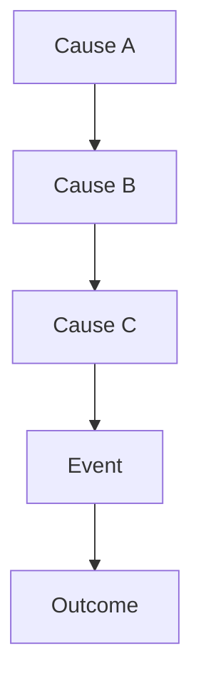
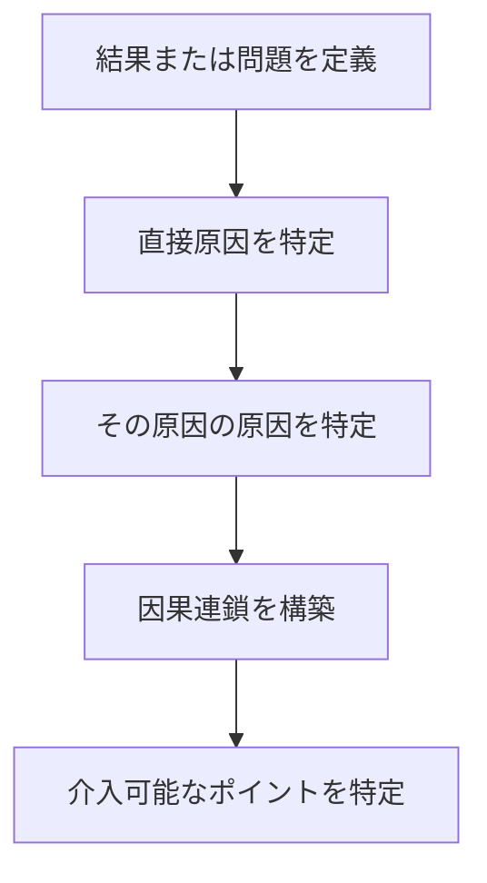

# 概要

Causal Chain Analysisは、出来事や問題がどのような因果の連鎖（causal chain）によって発生したかを分析するフレームワークである。
多くの問題は単一の原因ではなく、複数の要因が連鎖的に作用して結果を生む。
Causal Chain Analysisは
- 出来事の因果関係を明確にする
- 原因の階層構造を理解する
- 介入可能なポイントを特定する
ために用いられる。

---

# 因果連鎖の基本構造

結果は単一原因ではなく、複数の原因が連鎖した結果によって発生する。

---

# 手順

---

# 分析のポイント

Causal Chain Analysisでは次を確認する。

## 直接原因

結果に最も近い原因

## 根本原因

連鎖の起点となる原因

## 連鎖の構造

原因がどの順序で作用しているか

## 介入ポイント

どこを変えれば結果が変わるか

---

# 典型例
### 例：組織問題
人材不足  
↓  
業務過多  
↓  
ストレス増加  
↓  
離職

### 例：交通事故
視界不良  
↓  
速度超過  
↓  
制動距離不足  
↓  
衝突

---

# 他フレームとの関係

| フレーム                         | 役割        |
| ---------------------------- | --------- |
| [[02_zettelkasten/Zettelkasten Engine/03_process/methods/analysis/なぜなぜ分析]]             | 原因を掘り下げる  |
| [[02_zettelkasten/Zettelkasten Engine/03_process/methods/analysis/根因分析]]   | 根本原因の特定   |
| [[02_zettelkasten/Zettelkasten Engine/03_process/methods/analysis/因果連鎖分析]] | 因果の連鎖を可視化 |
| [[02_zettelkasten/Zettelkasten Engine/03_process/methods/analysis/システムマッピング]]        | 因果構造の全体図  |

---

# 重要性

多くの問題分析は単一原因で説明しようとして失敗する。
Causal Chain Analysisは複数要因による因果の連鎖を明らかにする。

---

# 関連ノート

- [[02_zettelkasten/Zettelkasten Engine/03_process/methods/analysis/根因分析]]    
- [[02_zettelkasten/Zettelkasten Engine/03_process/methods/analysis/なぜなぜ分析]]    
- [[02_zettelkasten/Zettelkasten Engine/03_process/methods/analysis/システムマッピング]]    
- [[02_zettelkasten/Zettelkasten Engine/03_process/methods/analysis/00 Analysis Framework hub]]