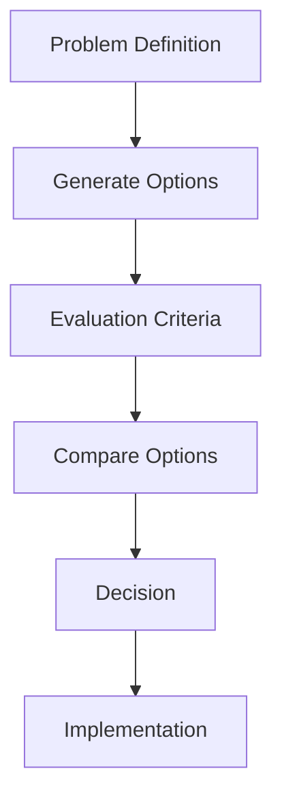
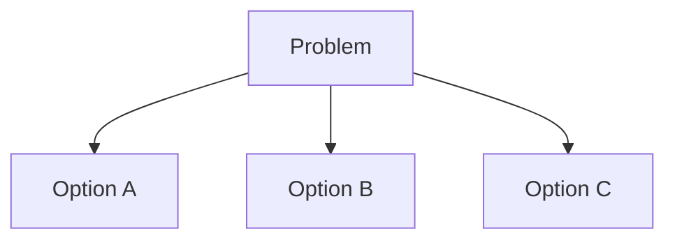
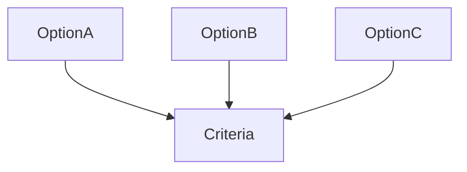
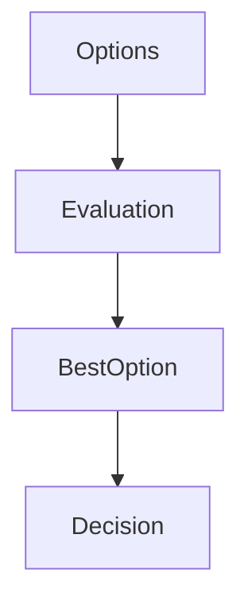

# 概要
意思決定フレームワークは、複雑な意思決定を体系的に行うための思考フレームワークである。
多くの意思決定の失敗は、
- 問題定義の誤り
- 選択肢不足
- 評価基準不明確
によって起こる。
Decision Frameworkは、意思決定の構造を整理するための手順を提供する。
# 基本フロー

# 手順
## Step1 問題定義
まず何を決めるのかを明確にする。
## Step2 選択肢生成
選択肢を複数用意する。多くの誤りは、選択肢が少ないことで起きる。

## Step3 評価基準
意思決定には評価軸が必要。
例

|Criteria|例|
|---|---|
|Cost|費用|
|Risk|リスク|
|Return|利益|
|Time|時間|
## Step4 選択肢評価

ここで、[[02_zettelkasten/Zettelkasten Engine/03_process/methods/analysis/トレードオフ分析]]が使われる。
## Step5 意思決定

最もバランスの良い選択肢を採用。
## Step6 実行
意思決定は、実行して初めて意味を持つ。
# 利点
- 判断ミスを減らす
- 議論を構造化できる
- 再利用可能
# 関連ノート
- [[02_zettelkasten/Zettelkasten Engine/03_process/methods/analysis/トレードオフ分析]]    
- [[02_zettelkasten/Zettelkasten Engine/03_process/methods/analysis/根因分析]]
- [[02_zettelkasten/Zettelkasten Engine/03_process/methods/analysis/ステークホルダー分析]]