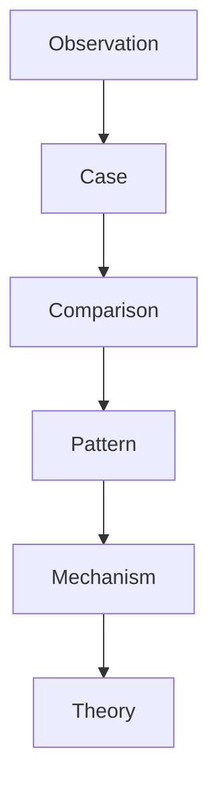
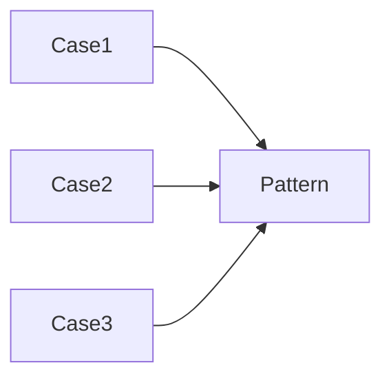
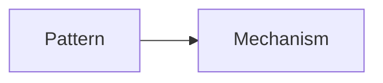
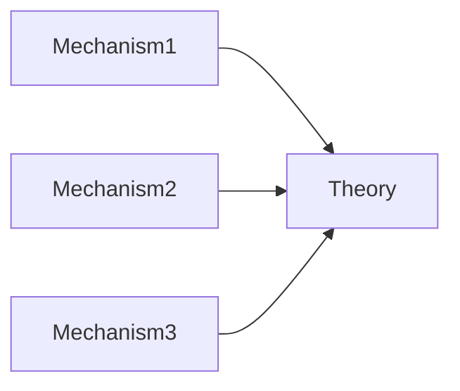
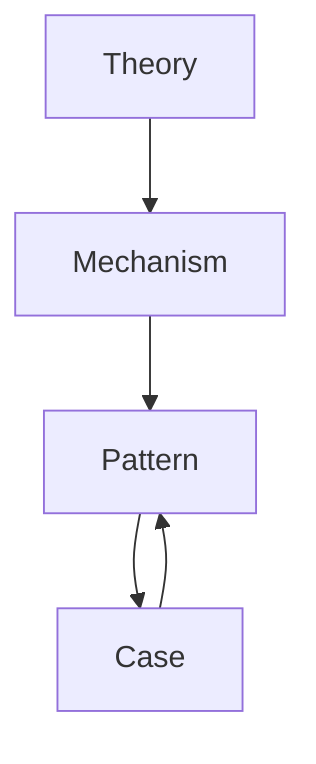
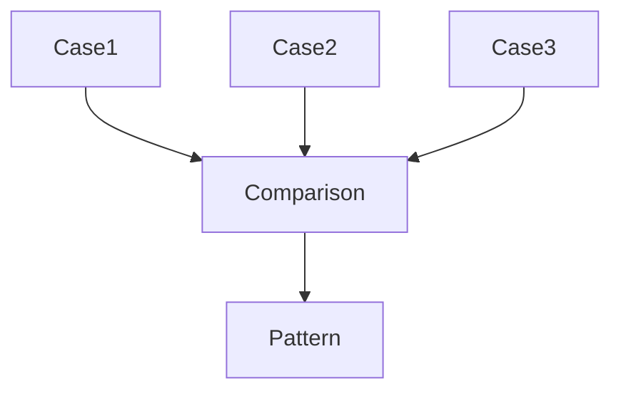
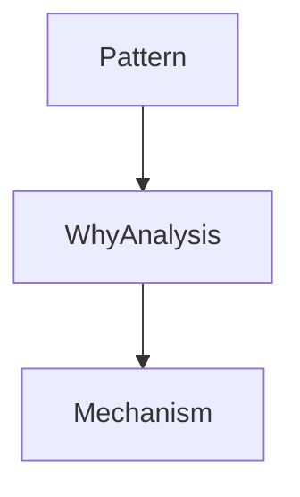
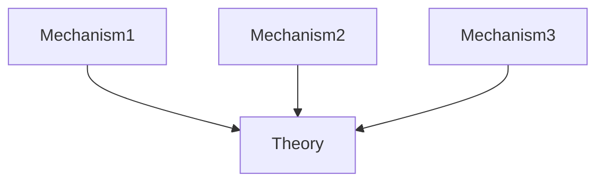
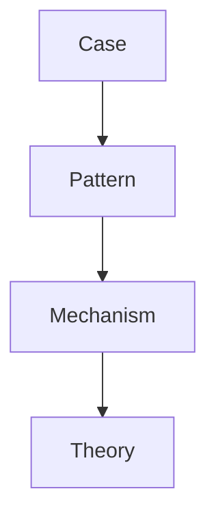
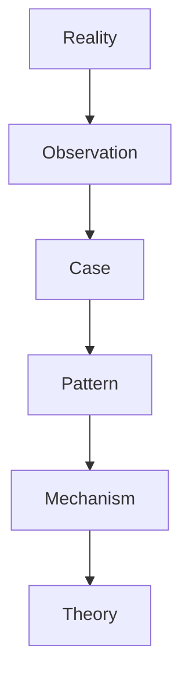

# Vault Knowledge Evolution System

Vault Knowledge Evolution System は  
このVaultにおける **知識の成長プロセス** を定義する。

Vaultでは知識は固定された情報ではない。

知識は

観察  
→ 事例  
→ パターン  
→ メカニズム  
→ 理論  

へと進化する。

---

# 知識進化の全体構造

---

# Knowledge Levels

Vaultでは知識を5段階に分類する。

| Level | 内容 |
|---|---|
|Observation | 観察 |
|Case | 具体事例 |
|Pattern | 繰り返し現れる型 |
|Mechanism | 仕組み |
|Theory | 抽象理論 |

---

# Level 1 Observation

Observation は、現実の観察データである。

例

・歴史事件の記録  
・企業行動  
・政治発言  
・制度変化  

Observation はらCaseの素材になる。
[[observation Hub]]

---

# Level 2 Case

Case は、Observation を整理した **具体事例ノード**である。

例

- デイリーテレグラフ事件
- サライェヴォ事件
- ウォーターゲート事件

Caseの目的

・現象の記録  
・比較の素材  

[[Case Hub]]

---

# Level 3 Pattern

Pattern は、複数 Case に共通する **現象の型**である。

例

- 指導者舌禍
- 革命連鎖
- 独占形成
- 責任回避

Patternの特徴

・繰り返し現れる  
・抽象度が上がる  

[[02_zettelkasten/Zettelkasten Engine/02_knowledge/world_model/model_hub/Pattern Hub|Pattern Hub]]

---

# Level 4 Mechanism

Mechanism は、Pattern を生み出す **仕組み**である。

例

- 情報拡散
- ネットワーク効果
- エリート対立
- 同調圧力

Mechanism は、現象のなぜを説明する。

[[02_zettelkasten/Zettelkasten Engine/02_knowledge/world_model/mechanism/Mechanism Hub|Mechanism Hub]]

---

# Level 5 Theory

Theory は、Mechanism を統合した 高次抽象モデルである。

例

- 革命理論
- 市場競争理論
- 情報社会理論

Theory は、Mechanism の集合体である。

[[02_zettelkasten/Zettelkasten Engine/02_knowledge/world_model/theory/Theory Hub|Theory Hub]]

---

# Knowledge Promotion

知識は次の条件で昇格する。

## Case → Pattern

条件

- 類似Caseが複数存在する
- 共通構造が確認できる

---

## Pattern → Mechanism

条件

- Patternの原因構造が説明できる

---

## Mechanism → Theory

条件

- Mechanismが複数統合される

---

# Knowledge Evolution Loop

知識は一方向ではなく循環する。

つまり、理論は新しいCaseを説明し、Caseは理論を更新する。

---

# Pattern Extraction

Patternは、Case比較から抽出される。

---

# Mechanism Identification

Mechanismは、Patternの原因分析から見つかる。

---

# Theory Construction

Theoryは、複数Mechanismの統合で作られる。

---

# Knowledge Graph との関係

Knowledge Evolution は、Knowledge Graph 上で起きる。

つまり、
Knowledge Graph は知識の地図。
Knowledge Evolution は知識の成長である。

---

# Vault運用原則

Principle 1  
Case を増やす。

Principle 2  
Comparison を行う。

Principle 3  
Pattern を抽出する。

Principle 4  
Mechanism を説明する。

Principle 5  
Theory を構築する。

---

# Vaultの知識生成モデル

---

# まとめ

このVaultは、知識保存システムではない。

このVaultは、知識進化システムである。

Caseから始まり、Theoryへ進化する。

そのプロセスを管理するのが、Vault Knowledge Evolution System である。