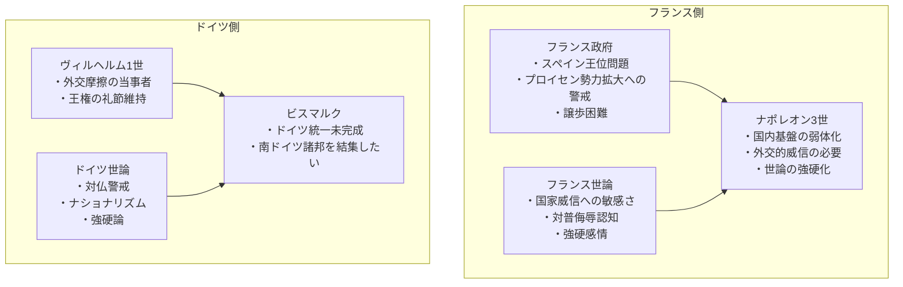
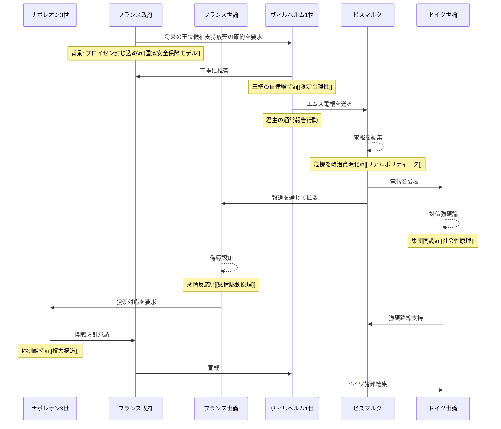
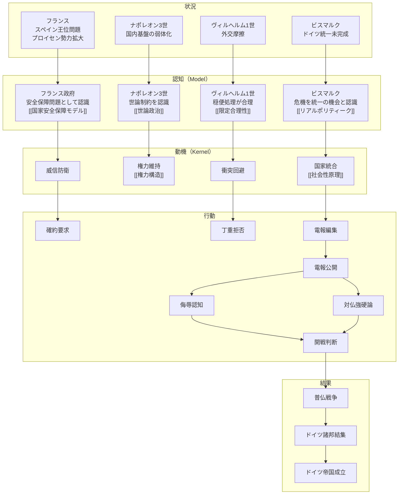
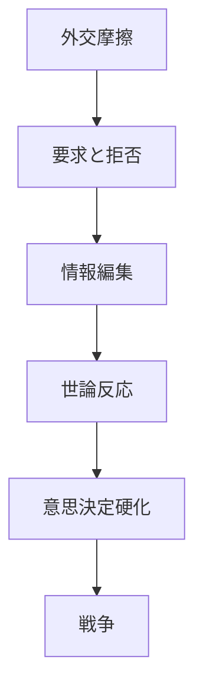

# エムス電報事件

エムス電報事件とは、1870年、スペイン王位継承問題をめぐる外交摩擦の中で、  
プロイセン王ヴィルヘルム1世とフランス側の外交要求のやり取りを、  
ビスマルクが政治的に編集して公表したことにより、  
両国の世論が刺激され、最終的に普仏戦争へと発展した事件である。

この事件は単なる外交トラブルではなく、

- 指導者が置かれた政治的制約
- 外交行為の意味の再解釈
- 世論の感情的反応
- 国家意思決定の硬化

が連鎖して戦争へ至った事例である。

---

# 1 背景・心情・置かれた状況

---

# 2 時系列の相互作用構造

---

# 3 行動モデル図  
## 状況 → 認知 → 動機 → 行動 → 結果

---

# 4 主体ごとの整理

## ナポレオン3世

### 置かれた状況
- 国内基盤が弱体化
- 外交的威信が必要
- 世論の強硬化

### 認知
- 譲歩は体制弱体化と認識  
[[02_zettelkasten/model/human/human/予測処理原理]]  
[[世論政治]]

### 動機
- 体制維持  
[[02_zettelkasten/Zettelkasten Engine/02_knowledge/world_model/meta/pattern/state/structure/権力構造]]

### 行動
- 強硬方針承認
- 開戦判断

---

## フランス政府

### 置かれた状況
- スペイン王位問題
- プロイセン勢力拡大

### 認知
- 安全保障問題  
[[国家安全保障モデル]]

### 動機
- 威信防衛
- 国家安全保障

### 行動
- 確約要求
- 外交圧力

---

## フランス世論

### 置かれた状況
- 電報報道

### 認知
- 国家侮辱として解釈

### 動機
- 国威回復  
[[02_zettelkasten/Zettelkasten Engine/02_knowledge/world_model/model/human/human/感情駆動原理]]

### 行動
- 強硬世論

---

## ヴィルヘルム1世

### 置かれた状況
- 外交摩擦

### 認知
- 穏便処理が合理  
[[02_zettelkasten/Zettelkasten Engine/02_knowledge/world_model/meta/model/human/congnition/限定合理性]]

### 動機
- 王権維持

### 行動
- 丁重拒否
- 電報報告

---

## ビスマルク

### 置かれた状況
- ドイツ統一未完成

### 認知
- 危機を統一機会と解釈  
[[リアルポリティーク]]

### 動機
- 国家統合

### 行動
- 電報編集
- 世論動員

---

# 5 抽象構造

---

# 6 一言で言うと

エムス電報事件とは、  
**外交上のやり取りそのものより、それを誰がどう編集し、世論がどう反応し、指導者の選択肢をどう狭めたかによって戦争が起きた事件**である。

---

# 7 参照先

## pattern
- [[威信競争]]
- [[世論動員]]
- [[情報編集]]
- [[エスカレーション]]

## model
- [[世論政治]]
- [[国家安全保障モデル]]
- [[国家統合モデル]]
- [[リアルポリティーク]]

## kernel
- [[02_zettelkasten/Zettelkasten Engine/02_knowledge/world_model/model/human/human/感情駆動原理]]
- [[02_zettelkasten/Zettelkasten Engine/02_knowledge/world_model/meta/model/human/human/社会性原理]]
- [[02_zettelkasten/Zettelkasten Engine/02_knowledge/world_model/meta/pattern/state/structure/権力構造]]
- [[02_zettelkasten/Zettelkasten Engine/02_knowledge/world_model/meta/model/human/congnition/限定合理性]]
- [[02_zettelkasten/model/human/human/予測処理原理]]