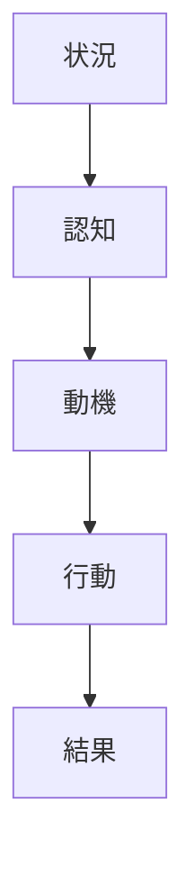
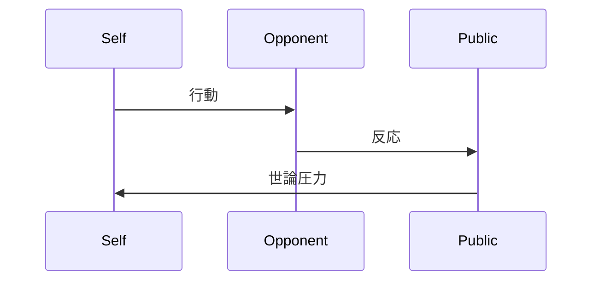

# {{人物名}}

歴史人物ノート

---

# 基本情報

名前  
生年  
没年  

役職  
政治家 / 軍人 / 皇帝 / 外交官など

---

# 時代状況（Situation）

この人物が置かれていた状況

- 国内政治
- 国際環境
- 個人的立場
- 制約

例

- 国家統一過程
- 王権と議会の対立
- 世論圧力

---

# 認知（Cognition）

この人物が世界をどう解釈していたか

関係model

- [[モデル名]]

例

- [[リアルポリティーク]]
- [[国家安全保障モデル]]

---

# 動機（Motivation）

何を達成しようとしていたか

関係kernel

- [[kernel名]]

例

- [[02_zettelkasten/Zettelkasten Engine/01_knowledge/world_model/meta/pattern/state/structure/権力構造]]
- [[02_zettelkasten/Zettelkasten Engine/01_knowledge/world_model/meta/model/human/human/社会性原理]]
- [[02_zettelkasten/Zettelkasten Engine/01_knowledge/world_model/model/human/human/感情駆動原理]]

---

# 行動（Action）

具体的な政治行動

関係事件

- [[事件名]]

例

- [[02_zettelkasten/Zettelkasten Engine/04_meta/case_intelligence/cases/history/events/エムス電報事件]]

---

# 結果（Outcome）

行動の結果

- 国内政治への影響
- 国際政治への影響
- 長期的影響

---

# 行動モデル

---

# 関与事件

- [[事件名]]

---

# 行動パターン

この人物に見られる反復構造

- [[pattern名]]

例

- [[威信競争]]
- [[外交エスカレーション]]

---

# 関連モデル

- [[model名]]

---

# 関連原理（kernel）

- [[kernel名]]

---

# 人物相互作用

---

# 抽象化

この人物の行動構造

1. 状況
2. 認知
3. 動機
4. 行動
5. 結果

---

# 関連ノート

- [[History Hub]]
- [[歴史分析構造]]