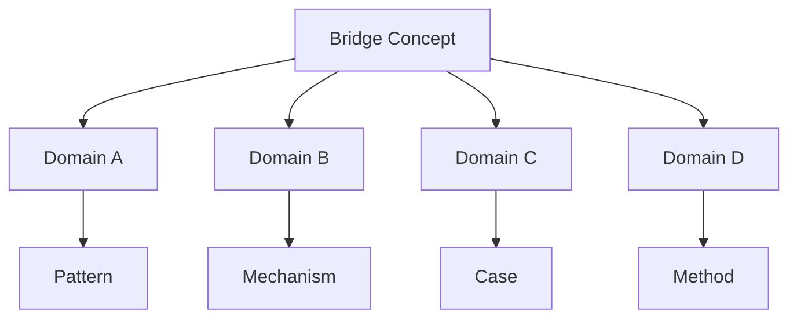
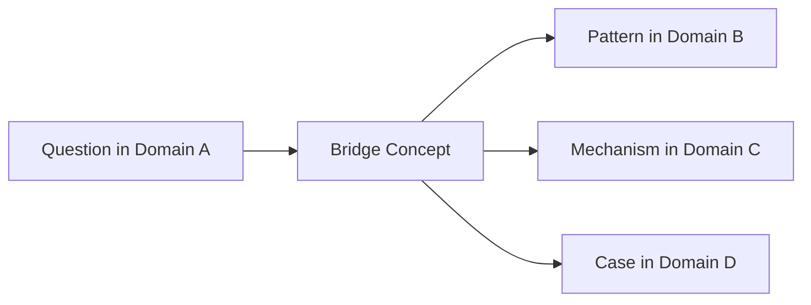
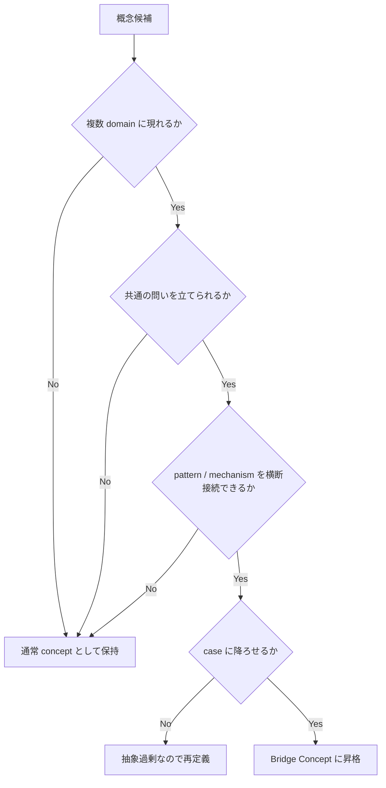

# Bridge Concept

Bridge Concept は、Knowledge Graph において  
**複数の domain・model・pattern・method を横断的に接続する中継概念**である。

Knowledge Graph は node と edge だけでは十分ではない。  
各領域がそれぞれ整っていても、間をつなぐ概念がなければ、Vault 全体は

- history は history の中だけ
- business は business の中だけ
- psychology は psychology の中だけ
- law は law の中だけ

で閉じやすい。

Bridge Concept は、こうした分野間の断絶を越えて、  
異なる領域にある知識を  
**同じ構造・同じメカニズム・同じ問いのもとで読み替えるための接続点**である。

---

# 定義

Bridge Concept とは、  
複数の領域やノード群にまたがって現れ、  
それらのあいだに **共通の意味軸・構造軸・作動軸** を与える概念である。

その主な役割は次の通りである。

1. domain 横断を可能にする  
2. 類比・比較・応用の中継点になる  
3. isolated cluster を接続する  
4. reasoning path のジャンプ点になる  
5. pattern と mechanism の再利用性を高める  
6. LLM に横断的 retrieval の足場を与える  

Bridge Concept は、  
単に「いろいろな所で使われる言葉」ではない。  
重要なのは、**異なる領域の知識を、同じ観点で結び直せること**である。

---

# なぜ必要か

Vault が大きくなると、  
普通は縦方向の整備から始まる。

- domain ごとの hub ができる
- concept 群ができる
- pattern 群ができる
- method 群ができる

しかし次の段階で問題が起こる。

## 1. domain 島化
各分野が内部では豊かだが、相互に行き来しない。

## 2. 類比不能
似た構造があっても、橋概念がないため見つけられない。

## 3. 応用不能
心理で学んだことを営業や歴史に移せない。

## 4. hub 間断絶
Hub がそれぞれ立派でも、横断導線が弱い。

## 5. LLM の近傍検索偏重
表層語彙が違うと、別 cluster として扱われやすい。

Bridge Concept は、  
Vault 全体を「フォルダの集合」ではなく  
**横断可能な知識網** にするために必要である。

---

# 全体構造

```mermaid
graph TD

    A[Bridge Concept] --> B[Structural Bridge]
    A --> C[Mechanistic Bridge]
    A --> D[Normative Bridge]
    A --> E[Interpretive Bridge]
    A --> F[Operational Bridge]
    A --> G[Meta Bridge]

    B --> B1[Power]
    B --> B2[Hierarchy]
    B --> B3[Center-Periphery]
    B --> B4[Network]
    B --> B5[Constraint]

    C --> C1[Signaling]
    C --> C2[Coordination]
    C --> C3[Trust]
    C --> C4[Feedback]
    C --> C5[Learning]

    D --> D1[Legitimacy]
    D --> D2[Responsibility]
    D --> D3[Justice]
    D --> D4[Norm]

    E --> E1[Identity]
    E --> E2[Narrative]
    E --> E3[Meaning]
    E --> E4[Recognition]

    F --> F1[Incentive]
    F --> F2[Information Asymmetry]
    F --> F3[Principal-Agent]
    F --> F4[Evaluation]

    G --> G1[System]
    G --> G2[Boundary]
    G --> G3[Adaptation]
    G --> G4[Resilience]
```

---

# Bridge Concept の本質

Bridge Concept の本質は、  
**別々に見える現象を、共通の問いで読めるようにすること** にある。

たとえば「権力」という概念は、

- 国家支配
- 企業組織
- fandom 内部秩序
- 家族内役割
- 学校制度
- 宗教組織

のすべてに現れる。

ここで重要なのは、  
「権力という単語が同じ」ことではなく、  
**資源配分・命令可能性・制裁可能性・正統化・抵抗**  
といった観点を共通に適用できることである。

Bridge Concept とは、  
知識を横断するための **共通のレンズ** である。

---

# Bridge Concept の条件

何でも bridge になるわけではない。  
よい Bridge Concept には次の条件がある。

---

## 1. 多領域出現性

複数の domain に現れる。

例:
- 信頼 → psychology / business / politics / tourism
- 正統性 → history / politics / organization / culture
- 制約 → economics / engineering / psychology / law

---

## 2. 構造再利用性

その概念を使うことで、  
ある領域の構造を別領域へ写せる。

例:
- center-periphery
- principal-agent
- signaling
- feedback

---

## 3. 問い生成力

その概念を持ち込むと、新しい問いが立つ。

例:
- この組織では誰が正統性を供給しているか
- この市場では何が signal になっているか
- この共同体ではどこに境界が引かれているか

---

## 4. Traversal 中継力

Question から別 domain へ移る中継点として使える。

---

## 5. 抽象度の適切さ

抽象すぎず、固有すぎない。

悪い bridge:
- 世界
- すべて
- 人間らしさ

固有すぎる bridge:
- ある一国固有制度名
- 一作品固有設定

良い bridge:
- 正統性
- 信頼
- インセンティブ
- アイデンティティ
- 制約
- 境界

---

# Bridge Concept の主な型

Bridge Concept にはいくつかの類型がある。

---

## 1. Structural Bridge

配置や骨格を横断する概念。

例:
- 階層
- 中心周辺
- 境界
- ネットワーク
- 分業
- 委任

使い道:
- 社会構造
- 組織構造
- 国家構造
- 都市構造
- fandom 構造

---

## 2. Mechanistic Bridge

作動過程を横断する概念。

例:
- シグナリング
- 同調
- 協調
- フィードバック
- 学習
- 逸脱制裁

使い道:
- 市場
- 組織
- SNS
- 政治
- 教育

---

## 3. Normative Bridge

価値・正当化・規範を横断する概念。

例:
- 正統性
- 責任
- 公正
- 義務
- 権利
- 規範

使い道:
- 歴史
- 法
- 組織
- 宗教
- 文化研究

---

## 4. Interpretive Bridge

意味づけ・自己理解・物語化を横断する概念。

例:
- アイデンティティ
- 物語
- 承認
- 象徴
- 記憶
- 意味

使い道:
- 人格
- 国家
- fandom
- ブランド
- 歴史叙述

---

## 5. Operational Bridge

行動設計・実務設計に関わる横断概念。

例:
- インセンティブ
- 評価
- 情報非対称
- principal-agent
- KPI
- ボトルネック

使い道:
- business
- public policy
- organization
- education
- platform design

---

## 6. Meta Bridge

システム全体の状態や変化を読む概念。

例:
- システム
- 適応
- レジリエンス
- 崩壊
- 安定
- 再編

使い道:
- 歴史
- 生態
- 組織
- 地域社会
- 事業設計

---

# Bridge Concept の図

---

# 代表的な Bridge Concept 例

以下は特に強い Bridge Concept である。

---

## 1. Power / 権力

つなぐ領域:
- history
- politics
- business
- organization
- culture
- family

つなぐ問い:
- 誰が何を決められるか
- 誰が制裁できるか
- 誰が正当化を独占しているか

---

## 2. Legitimacy / 正統性

つなぐ領域:
- 国家
- 組織
- 宗教
- fandom
- リーダーシップ
- ブランド

つなぐ問い:
- なぜ従うのか
- 何によって支配は受容されるのか
- 何が崩れると秩序は揺らぐのか

---

## 3. Constraint / 制約

つなぐ領域:
- economics
- psychology
- engineering
- law
- management
- urban planning

つなぐ問い:
- 何が可能範囲を決めているか
- 何が行為を制限しているか
- 理想と実行の差はどこから来るか

---

## 4. Trust / 信頼

つなぐ領域:
- social psychology
- organization
- market
- tourism
- community
- politics

つなぐ問い:
- 協力は何によって成立するか
- 裏切りは何を壊すか
- 可視性と評判はどう機能するか

---

## 5. Signaling / シグナリング

つなぐ領域:
- labor market
- branding
- education
- mating
- politics
- platform economy

つなぐ問い:
- 観察できない品質をどう伝えるか
- なぜ高コスト signal が効くのか
- 何が credential になるのか

---

## 6. Identity / アイデンティティ

つなぐ領域:
- personality
- nation
- organization culture
- fandom
- narrative analysis
- memory studies

つなぐ問い:
- 自己像はどう維持されるか
- 集団帰属はどう働くか
- 異物排除は何を守っているのか

---

## 7. Boundary / 境界

つなぐ領域:
- law
- community
- ethnicity
- fandom
- organization
- geography

つなぐ問い:
- 内と外はどこで区切られるか
- 誰が membership を決めるか
- 越境はなぜ摩擦を起こすか

---

## 8. Incentive / インセンティブ

つなぐ領域:
- economics
- management
- education
- public policy
- platform design

つなぐ問い:
- 人は何に反応して行動を変えるか
- 目標設定がどんな歪みを生むか
- 評価制度は何を誘発するか

---

# Bridge Concept の作り方

Bridge Concept は最初から与えられることもあるが、  
多くは運用の中で発見される。

---

## Step 1. cluster を観察する

別 domain に似た問題や mechanism がないかを見る。

例:
- 歴史の支配構造
- 組織の承認構造
- fandom の規範構造

---

## Step 2. 共通して問える観点を探す

例:
- 誰が命令できるか
- 誰が membership を決めるか
- 何が signal になるか

---

## Step 3. 固有名を外し、共通概念に上げる

例:
- 王権、経営権、モデレーション権限
→ 権力 / 制裁権 / 正統性

---

## Step 4. domain ごとに接続する

Bridge Concept を中心に、
- domain A の pattern
- domain B の mechanism
- domain C の case
をつなぐ。

---

## Step 5. 代表 path を作る

Bridge Concept を経由する reasoning path を一つ以上作る。

---

# Bridge Concept の記述内容

Bridge Concept ノートには最低限、次を書くとよい。

## 1. 定義
何を共通軸として扱うか。

## 2. なぜ bridge なのか
どの domain をつなぐか。

## 3. 代表 domain
どこで現れるか。

## 4. 代表 pattern / mechanism
どのような形で現れるか。

## 5. 代表 case
抽象を支える anchor case は何か。

## 6. contrasts_with
近いが違う概念は何か。

## 7. traversal 例
どのように別領域へ飛べるか。

---

# Bridge Concept の典型 traversal

例:
- 組織の責任回避はなぜ起きるか
→ [[権力]]
→ [[委任構造]]
→ [[責任分散メカニズム]]
→ [[国家官僚制 case]]

---

# Bridge Concept と類比の関係

Bridge Concept は類比を助けるが、  
類比そのものではない。

## 類比
A と B が似ていると言う

## Bridge Concept
A と B を共通軸 C で読む

例:
- 国家官僚制と企業官僚制は似ている
これは類比

- 両者を「階層」「委任」「正統性」「責任分散」で読む
これが Bridge Concept の使用

つまり Bridge Concept は、  
類比の **根拠軸** を与える。

---

# Bridge Concept と Hub の関係

Bridge Concept は、  
しばしば Hub 間をつなぐノードになる。

例:
- Human Model Hub ↔ Social Pattern Hub
  - [[アイデンティティ]]
  - [[信頼]]
  - [[規範]]

- Business Hub ↔ Law Hub
  - [[責任]]
  - [[インセンティブ]]
  - [[02_zettelkasten/Zettelkasten Engine/01_knowledge/world_model/meta/model/social/information/情報非対称]]

- History Hub ↔ Organization Hub
  - [[権力]]
  - [[正統性]]
  - [[委任]]

Hub に bridge node を明示することで、  
cross-domain traversal が強くなる。

---

# 良い Bridge Concept の条件

## 1. 多領域に現れる
## 2. 問いを生む
## 3. pattern や mechanism を横断接続できる
## 4. 過度に曖昧でない
## 5. case と往復可能
## 6. 他 bridge とも接続できる

---

# 悪い Bridge Concept のパターン

## 1. 抽象過剰
何でも説明できるが、何も区別できない。

例:
- 世界
- 関係性
- 人間性

## 2. 固有過剰
特定作品・特定制度・特定事件にしか使えない。

## 3. 単語一致だけ
同じ言葉が使われているだけで、実際は構造が違う。

## 4. 橋でなく終点
bridge と言いながら、他 domain への path がない。

## 5. mechanism 不在
横断できるが、何が共通かが薄い。

---

# Bridge Concept の発見質問

新しい bridge 候補を見つけるために、次の問いが使える。

## 1. この概念は別 domain にも現れるか
## 2. この概念を持ち込むと新しい問いが立つか
## 3. この概念で複数 case を比較できるか
## 4. この概念は pattern や mechanism を横断できるか
## 5. この概念は hub 間の導線になるか
## 6. 具体例に降ろせるか

---

# Bridge Concept 判定フロー

---

# LLM にとっての意味

Bridge Concept が整っていると、LLM は

- 別 domain の知識を共通軸で取り寄せやすくなり
- 類比や応用を、表層語彙でなく構造で行いやすくなり
- hub 間を迷わず横断しやすくなり
- 新しい問いに対して再利用可能な枠組みを持ちやすくなる

つまり Bridge Concept は、  
LLM にとっての **横断推論の橋脚** である。

---

# この Vault における実装方針

この Vault では、Bridge Concept を意識的に整備すると、  
各 domain OS がつながりやすくなる。

まず優先して整えるとよい候補:
- [[権力]]
- [[正統性]]
- [[02_zettelkasten/Zettelkasten Engine/01_knowledge/world_model/concept/制約]]
- [[信頼]]
- [[02_zettelkasten/Zettelkasten Engine/01_knowledge/world_model/meta/model/social/information/シグナリング]]
- [[アイデンティティ]]
- [[境界]]
- [[インセンティブ]]
- [[02_zettelkasten/Zettelkasten Engine/01_knowledge/world_model/meta/model/social/information/情報非対称]]
- [[責任]]

運用方針:
- hub に bridge node として明記する
- 代表 domain を本文に列挙する
- 各 bridge に最低2つ以上の anchor case をつける
- traversal 例を一つ以上書く

---

# 他ノートとの接続

## 上位
- [[Knowledge Graph]]

## 近接
- [[Traversal]]
- [[02_zettelkasten/04_knowledge_graph/Reasoning Path]]
- [[Hub Design Rule]]
- [[02_zettelkasten/04_knowledge_graph/Anchor Case]]
- [[02_zettelkasten/04_knowledge_graph/Case to Pattern Promotion]]

## 下位候補
- [[Power as Bridge Concept]]
- [[Legitimacy as Bridge Concept]]
- [[Constraint as Bridge Concept]]
- [[Identity as Bridge Concept]]
- [[Trust as Bridge Concept]]

---

# まとめ

Bridge Concept は、Knowledge Graph において  
**複数の domain・pattern・mechanism・case を横断的につなぐ中継概念**である。

これにより、

- domain 島化を防ぎ
- 類比と応用を可能にし
- hub 間導線を強め
- LLM の横断推論を安定させる

ことができる。

個別知識が島なら、  
Bridge Concept はそれらを結ぶ橋である。