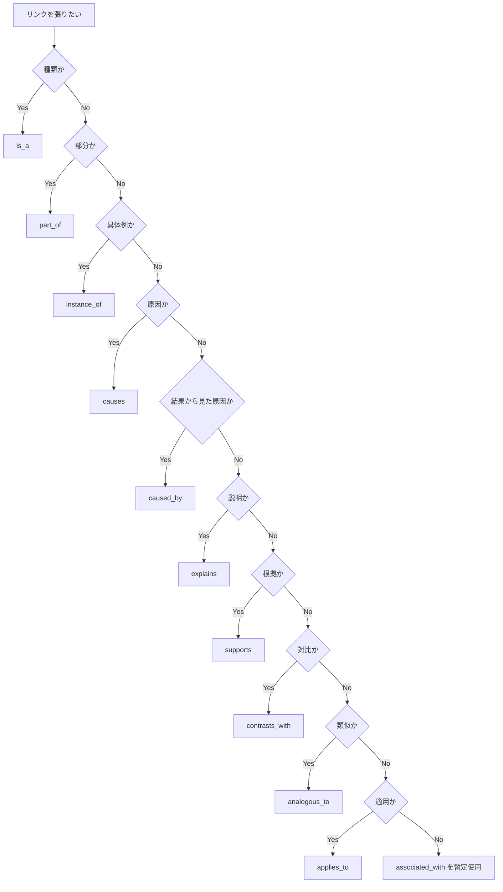

# Edge Type

Edge Type は、Knowledge Graph において  
**ノードとノードの間にどの種類の関係があるか** を定義する構造である。

Knowledge Graph が単なる「つながっている図」で終わるか、  
実際に reasoning に使える構造になるかは、  
Node の数よりもむしろ **Edge の型づけ** に依存する。

Node Type が「それは何か」を定めるものだとすれば、  
Edge Type は「それは何とどういう関係にあるか」を定めるものである。

---

# 定義

Edge Type とは、  
Knowledge Graph におけるノード間関係の**意味的分類**である。

単なるリンクは「関係がある」ことしか示さない。  
しかし reasoning に必要なのは、

- 上位下位関係なのか
- 部分全体関係なのか
- 原因結果関係なのか
- 具体例と抽象の関係なのか
- 適用関係なのか
- 対比関係なのか

を明確に区別することである。

Edge Type の目的は次の通りである。

1. ノード間関係の意味を固定する  
2. 推論の方向を安定させる  
3. 類似・因果・所属の混同を防ぐ  
4. 上向き探索と下向き探索を可能にする  
5. LLM が説明文を生成しやすくする  

---

# なぜ必要か

Edge が曖昧な Graph は、見た目は豊かでも実用性が低い。

たとえば次のリンクは全部違う。

- 韓国併合 → 植民地化
- 植民地化 → 帝国主義
- 情報非対称 → 逆選択
- 同調 → 集団意思決定
- 比較分析 → 歴史研究
- 信頼 → 裏切り

これらを全部「related_to」で済ませると、

- 何が原因か分からない
- 何が上位概念か分からない
- 何が具体例か分からない
- どう辿ればよいか分からない

結果として、Graph は検索補助にはなっても、
思考補助にはならない。

Edge Type は、知識を**辿れるもの**に変えるための条件である。

---

# 全体構造

```mermaid
graph TD

    A[Edge Type] --> B[Taxonomic Relations]
    A --> C[Compositional Relations]
    A --> D[Causal Relations]
    A --> E[Explanatory Relations]
    A --> F[Similarity Relations]
    A --> G[Applicative Relations]
    A --> H[Contextual Relations]
    A --> I[Operational Relations]

    B --> B1[is_a]
    B --> B2[instance_of]

    C --> C1[part_of]
    C --> C2[has_part]

    D --> D1[causes]
    D --> D2[caused_by]
    D --> D3[enables]
    D --> D4[constrains]

    E --> E1[explains]
    E --> E2[supports]
    E --> E3[evidenced_by]

    F --> F1[analogous_to]
    F --> F2[contrasts_with]

    G --> G1[applies_to]
    G --> G2[used_in]

    H --> H1[operates_in]
    H --> H2[associated_with]
    H --> H3[performed_by]

    I --> I1[answers]
    I --> I2[uses]
    I --> I3[organizes]
```



---

# Edge Type の基本原則

## 1. Edge は意味を持つ
リンクは単なる接続ではなく、  
「どのような関係か」を明示する必要がある。

## 2. Edge には方向がある
多くの Edge は非対称である。

例:
- 情報非対称 causes 逆選択
- 逆選択 causes 情報非対称

この2つは同じではない。

## 3. Edge は推論の道になる
Graph は図ではなく経路である。  
Edge は推論の移動方向を決める。

## 4. Edge は少数精鋭にする
関係語を増やしすぎると崩れる。  
まずは少数の強い型で統一する。

## 5. Edge は Node Type と整合する
たとえば、

- Case instance_of Pattern
- Mechanism grounded in Kernel
- Method applies_to Domain

のように、使われやすい組み合わせがある。

---

# 中核 Edge Type

この Vault で最初に固定すべき中核 Edge は次の10個で十分である。

- is_a
- part_of
- instance_of
- causes
- caused_by
- explains
- supports
- contrasts_with
- analogous_to
- applies_to

これを中核語彙とする。

必要なら拡張語彙を後から追加する。

---

# 各 Edge Type の定義

## 1. is_a

分類関係。  
A は B の一種である。

例:
- 植民地化 is_a 支配形態
- 同調 is_a 社会的影響
- 期待価値モデル is_a 意思決定モデル

用途:
- 上位概念に遡る
- 概念分類を安定させる
- 抽象化に使う

典型接続:
- Concept → Concept
- Pattern → Pattern
- Structure → Structure
- Model → Model

注意:
- 「一部である」ではない
- 「具体例である」でもない

---

## 2. part_of

部分関係。  
A は B の構成要素である。

例:
- 動員装置 part_of 総力戦体制
- 問題定義 part_of 問題解決プロセス
- 承認段階 part_of 意思決定構造

用途:
- 全体構造を把握する
- 分解分析をする
- 構造ノートを作る

典型接続:
- Structure → Structure
- Step → Process
- Element → System

注意:
- is_a と混同しやすい
- A が B の種類なのか、部品なのかを区別する

---

## 3. instance_of

具体例関係。  
A は B の具体的事例である。

例:
- 韓国併合 instance_of 植民地化パターン
- ある炎上案件 instance_of 規範違反可視化パターン
- ある会議崩壊事例 instance_of 責任回避パターン

用途:
- 具体から抽象へ上がる
- Case を Pattern や Concept に接続する
- 類例探索を可能にする

典型接続:
- Case → Pattern
- Event → Pattern
- Actor 行動 → Role Pattern
- Observation → Hypothesis Candidate

注意:
- instance_of は一回限りの所属ではなく、抽象との接続
- case を is_a でつなげない

---

## 4. causes

原因関係。  
A が B を引き起こす。

例:
- 情報非対称 causes 逆選択
- 注意資源不足 causes 判断短絡
- 権力集中 causes 責任不透明化
- 過剰複雑化 causes 制度疲労

用途:
- 因果推論
- root cause analysis
- hypothesis 生成
- intervention 設計

典型接続:
- Kernel → Mechanism
- Mechanism → Outcome
- Structure → Mechanism
- Event → Event

注意:
- 相関を causes と書かない
- 因果が弱い場合は supports や associated_with を使う

---

## 5. caused_by

被原因関係。  
A は B によって生じる。

例:
- 制度疲労 caused_by 過剰複雑化
- 不信拡大 caused_by 裏切り経験
- 意思決定遅延 caused_by 承認多段化

用途:
- 結果から原因を逆探索する
- 診断思考を補助する
- Why 系の問いに使う

典型接続:
- Outcome → Mechanism
- Failure → Constraint
- Event → Prior Event

注意:
- caused_by は causes の逆向き
- 両方を書きたくなるが、運用上は片側でもよい
- 検索性重視なら両方持つのも可

---

## 6. explains

説明関係。  
A は B を説明する。

例:
- 限定合理性 explains 不完全意思決定
- アイデンティティ防衛 explains 認知的不協和の回避
- シグナリング理論 explains 学歴競争の一部

用途:
- 説明文生成
- 理論と現象の橋渡し
- 「なぜそう見えるのか」を記述する

典型接続:
- Kernel → Pattern
- Mechanism → Case
- Model → Phenomenon
- Concept → Distinction

注意:
- explains は causes より広い
- 説明はできても、厳密な原因ではない場合がある

---

## 7. supports

支援・根拠関係。  
A は B を支える、または妥当性を補強する。

例:
- 複数事例群 supports 植民地化パターン
- 統計データ supports 仮説
- 観察記録 supports 問題定義
- 文献知見 supports 比較仮説

用途:
- エビデンスを結びつける
- 仮説の妥当性を補強する
- 議論の根拠を束ねる

典型接続:
- Observation → Hypothesis
- Data → Claim
- Case Cluster → Pattern
- Source → Interpretation

注意:
- supports は証明ではない
- evidence の強さには差がある

---

## 8. contrasts_with

対比関係。  
A は B と重要な違いを持つ。

例:
- 正統性 contrasts_with 強制
- 市場調整 contrasts_with 計画統制
- 責任分散 contrasts_with 責任集中
- 予防型制度 contrasts_with 事後対処型制度

用途:
- 概念の輪郭を明確にする
- 誤同一視を防ぐ
- 比較思考を助ける

典型接続:
- Concept ↔ Concept
- Pattern ↔ Pattern
- Model ↔ Model
- Strategy ↔ Strategy

注意:
- 反対語でなくてもよい
- 重要な差異があることが核心

---

## 9. analogous_to

類比関係。  
A は B と似た構造や作動を持つ。

例:
- 企業官僚制 analogous_to 国家官僚制
- fandom 炎上 analogous_to 異端審問
- 就活シグナル競争 analogous_to 市場での品質シグナル
- 中心周辺構造 analogous_to 本社支社支配構造

用途:
- 分野横断
- 発想転用
- 抽象構造の再利用

典型接続:
- Domain Pattern ↔ Domain Pattern
- Structure ↔ Structure
- Case ↔ Case
- Model ↔ Model

注意:
- 類比は同一性ではない
- 似ている面と違う面の両方を書くと強い

---

## 10. applies_to

適用関係。  
A は B 領域や対象で有効である。

例:
- principal-agent problem applies_to 組織運営
- シグナリング applies_to 就活市場
- 権力分析 applies_to 歴史解釈
- 感情調整理論 applies_to 接客教育

用途:
- 抽象知を実務へ接続する
- 横断知を domain に落とす
- Tool / Method の使い道を示す

典型接続:
- Method → Domain
- Model → Domain
- Mechanism → Problem Type
- Tool → Task

注意:
- 「関係がある」だけでは applies_to にしない
- 実際に使えることが重要

---

# 拡張 Edge Type

中核10種で足りない場合、次を拡張語彙として使える。

---

## 11. has_part

全体側から部分を指す関係。

例:
- 総力戦体制 has_part 動員装置
- 営業プロセス has_part 提案設計

用途:
- part_of の逆方向
- 構造把握を両方向にする

---

## 12. enables

A が B を可能にする。  
直接原因ではないが、成立条件を与える。

例:
- 共通規範 enables 協力
- インフラ整備 enables 市場拡大
- 可視化 enables 介入判断

用途:
- 条件分析
- causes より弱い因果
- 基盤条件の整理

---

## 13. constrains

A が B を制約する。  
禁止ではないが、範囲を狭める。

例:
- 資源制約 constrains 行動選択
- 法制度 constrains 組織戦略
- 注意資源制約 constrains 学習速度

用途:
- 制約分析
- feasible set の把握
- 理想論への暴走防止

---

## 14. evidenced_by

A は B によって観察的に裏づけられる。

例:
- 仮説 evidenced_by インタビュー記録
- パターン evidenced_by 複数ケース
- 解釈 evidenced_by 文献引用

用途:
- supports をさらに証拠寄りにしたい時
- 調査ノートに便利

---

## 15. operates_in

A は B という構造・場・文脈で作動する。

例:
- 責任分散 operates_in 多段委任構造
- 同調形成 operates_in 集団環境
- フリーライダー化 operates_in 公共財状況

用途:
- Mechanism と Structure の接続
- 文脈依存性の可視化

---

## 16. associated_with

弱い関連関係。  
まだ型が未確定だが、つながりは重要である。

例:
- ある観察 associated_with 不信感
- 特定時代背景 associated_with 国家主義高揚

用途:
- 仮置き
- 未確定リンク
- 仮説前段階

注意:
- 乱用すると Graph が濁る
- 後でより強い Edge に置換する前提で使う

---

## 17. performed_by

行為・役割・イベントが誰によって担われたかを示す。

例:
- 併合推進 performed_by 日本政府
- 仲介交渉 performed_by 外交官僚
- 煽動行為 performed_by 特定メディア

用途:
- Actor と Event / Role を結ぶ
- 誰が動いたかを明確にする

---

## 18. uses

Method や Tool が何を使うかを示す。

例:
- 比較分析 uses 比較軸
- case template uses actor/event/constraint
- reasoning engine uses question node

用途:
- 運用設計
- Tool 間接続
- Workflow 可視化

---

## 19. answers

A が B という問いに答える関係。

例:
- 植民地化パターン answers 韓国併合は植民地化か
- 限定合理性 answers なぜ人は最適に動かないのか

用途:
- Question node の接続
- AI retrieval の入口整理

---

## 20. organizes

Hub や Framework が何を束ねるかを示す。

例:
- Human Model Hub organizes 認知・感情・動機
- Pattern Hub organizes social pattern 群

用途:
- Meta ノードを整理する
- Hub の役割を明示する

---

# Edge Type の群別整理

## 1. 分類関係
- is_a
- instance_of

## 2. 構成関係
- part_of
- has_part

## 3. 因果関係
- causes
- caused_by
- enables
- constrains

## 4. 説明・根拠関係
- explains
- supports
- evidenced_by

## 5. 類似・対比関係
- analogous_to
- contrasts_with

## 6. 適用・運用関係
- applies_to
- uses
- answers
- organizes

## 7. 文脈・主体関係
- operates_in
- performed_by
- associated_with

---

# Edge Type の方向性

多くの Edge には方向がある。  
方向を揃えると Graph が格段に使いやすくなる。

---

## 上向き方向
具体 → 抽象

例:
- 韓国併合 instance_of 植民地化パターン
- 責任回避事例 instance_of 責任回避パターン

---

## 下向き方向
抽象 → 具体

例:
- シグナリング applies_to 就活市場
- 限定合理性 explains 不完全意思決定

---

## 因果順方向
原因 → 結果

例:
- 情報非対称 causes 逆選択
- 権力集中 causes 責任不透明化

---

## 逆因果方向
結果 → 原因

例:
- 逆選択 caused_by 情報非対称
- 判断短絡 caused_by 注意資源不足

---

## 構成方向
部分 → 全体

例:
- 動員装置 part_of 総力戦体制
- 承認段階 part_of 意思決定構造

---

# Edge Type の典型組み合わせ

Knowledge Graph では、Node Type と Edge Type の相性がある。

---

## Case から出やすい Edge
- instance_of → Pattern
- explained_by → Mechanism
- performed_by → Actor
- associated_with → Context

---

## Pattern から出やすい Edge
- is_a → 上位 Pattern
- explained_by → Mechanism
- applies_to → Domain
- contrasts_with → 他 Pattern

---

## Mechanism から出やすい Edge
- causes → Outcome
- operates_in → Structure
- grounded_in 相当として → Kernel
- applies_to → Domain

---

## Structure から出やすい Edge
- part_of → 上位 Structure
- enables → Mechanism
- constrains → Action
- analogous_to → 他 Structure

---

## Kernel から出やすい Edge
- explains → Pattern / Mechanism
- constrains → Choice
- contrasts_with → 他 Kernel
- applies_to → 多数 Domain

---

## Method / Tool から出やすい Edge
- applies_to → Domain / Task
- uses → Data / Schema
- answers → Question
- organizes → Node Cluster

---

# 良い Edge 設計の条件

## 1. 同じ関係語を継続的に使う
毎回別表現にすると Graph が壊れる。

悪い例:
- leads_to
- results_in
- produces
- creates

が混在する

よい例:
- 因果は causes に統一する

---

## 2. 強い関係と弱い関係を分ける
確信があるなら causes  
まだ弱いなら supports / associated_with

---

## 3. 因果と説明を分ける
explanation は always cause ではない。

例:
- アイデンティティ防衛 explains 態度硬直化
これは説明として有効だが、
常に単一原因とは限らない。

---

## 4. 部分関係と種類関係を分ける
- 寡占構造 is_a 市場構造
- 市場集中度 part_of 競争構造評価

この区別が重要。

---

## 5. 類比を乱用しない
analogous_to は面白いが危険。  
似ている次元を明示するとよい。

---

# よくある誤用

## 1. is_a の乱用
「韓国併合 is_a 植民地化」は不自然。  
これは instance_of の方が適切。

---

## 2. causes の乱用
相関や併存をすぐ causes にすると誤推論が増える。

---

## 3. part_of と instance_of の混同
- 承認段階 part_of 意思決定プロセス
- ある会議 instance_of 意思決定場面

これは別物。

---

## 4. related_to への逃避
便利だが、Graph の価値を下げやすい。  
未確定なら associated_with を暫定的に使う方がまだよい。

---

## 5. Edge を増やしすぎる
関係語が20個を超えると管理が崩れやすい。  
まずは中核10種を徹底する。

---

# 最小運用語彙

この Vault でまず固定するなら、以下を推奨する。

```text
is_a
part_of
instance_of
causes
caused_by
explains
supports
contrasts_with
analogous_to
applies_to
```

拡張が必要になったら、以下を追加する。

```text
enables
constrains
operates_in
performed_by
uses
answers
organizes
associated_with
has_part
evidenced_by
```

---

# Edge Type 判定のための質問

新しいリンクを張るときは、次の質問で判定する。

## 1. これは種類関係か
→ is_a

## 2. これは部分関係か
→ part_of

## 3. これは具体例か
→ instance_of

## 4. これは原因か
→ causes

## 5. これは結果から見た原因か
→ caused_by

## 6. これは説明として効くか
→ explains

## 7. これは根拠になるか
→ supports / evidenced_by

## 8. これは対比で理解した方がよいか
→ contrasts_with

## 9. これは似た構造を持つか
→ analogous_to

## 10. これは別領域に使えるか
→ applies_to

---

# Edge Type 判定フロー



---

# この Vault における実装方針

本文・property・Hub のいずれでもよいが、  
最低限、本文中で relation の型が読めるようにする。

記述例:

- [[韓国併合]] は [[植民地化パターン]] の **instance_of**
- [[02_zettelkasten/Zettelkasten Engine/01_knowledge/world_model/meta/model/social/information/情報非対称]] は [[02_zettelkasten/Zettelkasten Engine/01_knowledge/world_model/model/social/incentive/逆選択]] を **causes**
- [[02_zettelkasten/Zettelkasten Engine/01_knowledge/world_model/meta/model/human/congnition/限定合理性]] は [[不完全意思決定]] を **explains**
- [[責任分散]] は [[多段委任構造]] で **operates_in**
- [[比較分析]] は [[歴史研究]] に **applies_to**

これにより、LLM も人間も「どうつながっているか」を明確に読める。

---

# Node Type との接続

## 上位
- [[Knowledge Graph]]

## 近接
- [[02_zettelkasten/Zettelkasten Engine/04_meta/knowledge_graph/Node Type]]
- [[Traversal]]
- [[Graph Maintenance]]
- [[Hub Design Rule]]

## 下位候補
- [[Causal Relation]]
- [[Taxonomic Relation]]
- [[Part-Whole Relation]]
- [[Analogy Relation]]
- [[Applicative Relation]]

---

# まとめ

Edge Type は、Knowledge Graph において  
ノード同士の関係に**意味と方向**を与える構造である。

Edge Type が整うことで、

- Graph が単なるリンク集で終わらない
- 因果・分類・構成・類比を区別できる
- 抽象化と具体化が安定する
- LLM が reasoning path を辿りやすくなる
- 説明文が関係に沿って生成できる

知識の価値は、ノードの量だけでなく  
**どの型の Edge でつながっているか** によって決まる。
